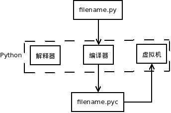

>You are the light of the world. A city located on a hill cannot be hidden. People do not light a lamp and put it under a basket but on a lampstand, and it gives light to all in the house. In te same way, let your light shine before people, so that they can see your good deeds and give honor to your Father in heaven.(Matthew 5:14-16)

>你们是世上的光。城造在山上，是不能隐藏的。人点灯，不放在斗底下，是放在灯台上，就照亮一家的人。你们的光也当这样照在人前，叫他们看见你们的好行为，便将荣耀归给你们在天上的父。

#一个简单的程序

学会了四则运算，就可以编程序。

这不是开玩笑，是真的。虽然是简单的程序。

这里说的程序当然不是在交互模式中敲出的几个命令，然后看到结果。那不算编程。

也不要担心学习的东西少而不能编程，因为编程没有那么难。只要你有胆量、有毅力，就一定能写出优秀的程序。

稍安勿躁，下面就开始编写一个真正的但是简单程序。

##程序

什么是程序，自维基百科记载：

[computer program and source code](http://en.wikipedia.org/wiki/Computer_program)（看不懂，很要紧，务必学习好英语，这是你认识世界工具——某国是世界一部分。想当初孙策临终前告诉孙权“外事不明学英语，内事不明学英语”，孙权谨记，才有曹孟德慨叹“生子当如孙仲谋”，因为曹丕和曹植，只学中文，不学英文，虽然这兄弟俩的诗词歌赋很有成就）。

>A computer program, or just a program, is a sequence of instructions, written to perform a specified task with a computer.[1] A computer requires programs to function, typically executing the program's instructions in a central processor.[2] The program has an executable form that the computer can use directly to execute the instructions. The same program in its human-readable source code form, from which executable programs are derived (e.g., compiled), enables a programmer to study and develop its algorithms. A collection of computer programs and related data is referred to as the software.

>Computer source code is typically written by computer programmers.[3] Source code is written in a programming language that usually follows one of two main paradigms: imperative or declarative programming. Source code may be converted into an executable file (sometimes called an executable program or a binary) by a compiler and later executed by a central processing unit. Alternatively, computer programs may be executed with the aid of an interpreter, or may be embedded directly into hardware.

>Computer programs may be ranked along functional lines: system software and application software. Two or more computer programs may run simultaneously on one computer from the perspective of the user, this process being known as multitasking.

维基百科上还记载这一段中文：[计算机程序](http://zh.wikipedia.org/wiki/%E8%AE%A1%E7%AE%97%E6%9C%BA%E7%A8%8B%E5%BA%8F)

>计算机程序（Computer Program）是指一组指示计算机或其他具有信息处理能力装置每一步动作的指令，通常用某种程序设计语言编写，运行于某种目标体系结构上。打个比方，一个程序就像一个用汉语（程序设计语言）写下的红烧肉菜谱（程序），用于指导懂汉语和烹饪手法的人（体系结构）来做这个菜。

>通常，计算机程序要经过编译和链接而成为一种人们不易看清而计算机可解读的格式，然后运行。未经编译就可运行的程序，通常称之为脚本程序（script）。

程序，简而言之，就是指令的集合。但是，有的程序需要编译，有的不需要。Python编写的程序就不需要单独做编译操作（对人而言，不需要执行这个命令），因此她也被称之为解释性语言。但是，这种称呼容易产生误解。

在有的程序员头脑中，有一种认为“编译型语言比解释性语言高价”的认识。

这是错误的。

学完Python，你就知晓。

不争论。用得妙就是好。

##用IDLE的编程

能够写Python程序的工具很多，比如记事本就可以。当然，很多人总希望能用一个专门的编程工具，Python里面自带了一个，作为简单应用是足够了。另外，可以根据自己的喜好用其它的工具，比如我用的是vim，有不少人也用eclipse，还有notepad++，等等。软件领域为编程提供了丰富多彩的工具。

以Python默认的IDLE为例，如下所示：

操作：File->New window

这样，就出现了一个新的操作界面，在这个界面里面，看不到用于输入指令的提示符：>>>，这个界面有点像记事本。说对了，本质上就是一个记事本，只能输入文本，不能直接在里面贴图片。

##写两个大字：Hello,World

Hello,World.是面向世界的标志，所以，写任何程序，第一句一定要写这个，因为程序员是面向世界的，绝对不畏缩在某个局域网内，所以，所以要会科学上网，才能真正与世界Hello。

直接上代码，就这么一行即可。

    print "Hello,World"

如下图的样式

前面说过了，程序就是指令的集合，现在，这个程序里面，就一条指令。一条指令也可以成为集合。

注意观察，菜单上有一个RUN，点击这个菜单，在下拉列表里面选择Run Module。

会弹出对话框，要求把这个文件保存，这就比较简单了，保存到一个位置，一定要记住这个位置，并且取个文件名，文件名是以.py为扩展名的。

都做好之后，点击确定按钮，就会发现在另外一个带有`>>>`的界面中，就自动出来了Hello,World两个大字。

成功了吗？成功了也别兴奋，因为还没有到庆祝的时候。

在这种情况系，我们依然是在IDLE的环境中实现了刚才那段程序的自动执行，如果脱离这个环境呢？

下面就关闭IDLE，打开shell(如果看官在使用苹果的 Mac OS 操作系统或者某种linux发行版的操作系统，比如我使用的是ubuntu)，或者打开cmd(windows操作系统的用户，特别提醒用windows的用户，使用windows不是你的错，错就错在你只会使用鼠标点来点去，而不想也不会使用命令，更不想也不会使用linux的命令，还梦想成为优秀程序员。)，通过命令的方式，进入到你保存刚才的文件目录。

下图是我保存那个文件的地址，我把那个文件命名为105.py，并保存在一个文件夹中。

然后在这个shell里面，Python 2则输入：`python 105.py`；Python 3则输入：`python3 105.py`。

上面这句话的含义就是告诉计算机，运行一个Python语言编写的程序，那个程序文件的名称是105.py

我的计算机我做主。于是它给我乖乖地执行了这条命令。如下图：

还在沉默？可以欢呼了，德国队7:1胜巴西队（我在写这段的时候，正好世界杯），不管是德国队还是巴西队的粉丝，都可以欢呼，因为你在程序员道路上迈出了伟大的第二步（什么时候迈出的第一步？）。顺便预测一下，本届世界杯最终冠军应该是：中国队。（还有这么扯的吗？）

##解一道题目

请计算：19+2*4-8/2

代码如下：
	
	#!/usr/bin/env python
    #coding:utf-8
    
    """
    请计算：
	19+2*4-8/2
    """
    
    a = 19 + 2 * 4 - 8 / 2
    print a                        # python 3: print(a)

提醒初学者，别复制这段代码，而是要一个字一个字的敲进去。然后保存(我保存的文件名是:105-1.py)。

在shell或者cmd中，执行：python (文件名.py)

执行结果如下图：

好像还是比较简单。

下面对这个简单程序进行一一解释。

    #!/usr/bin/env python
	
在Linux操作系统中，这一行是必须写的，它能够引导程序找到python的解析器，也就是说，不管你这个文件保存在什么地方，这个程序都能执行，而不用制定Python的安装路径。如果是Windows操作系统，则不必写。

    #coding:utf-8
	
这一行是告诉Python，本程序采用的编码格式是utf-8。

什么是编码？什么是utf-8？

这是一个比较复杂且有历史的问题，此处暂不讨论。只有有了上面这句话，后面的程序中才能写汉字，否则就会报错了。不管你信还是不信，都应该把程序中的这行删掉，然后运行程序，看看什么结果？

    """
    请计算：
	19+2*4-8/2
    """
这一行是给人看的，计算机看不懂。在Python程序中（别的编程语言也是如此），要写所谓的注释，就是对程序或者某段语句的说明文字，这些文字在计算机执行程序的时候，被计算机姑娘忽略，但是，注释又是必不可少的，正如前面说的那样，程序在大多数情况下是给人看的。注释就是帮助人理解程序的。

写注释的方式有两种，一种是单行注释，用`#`开头，另外一种是多行注释，用一对`'''`包裹起来。比如：
    
	"""
    请计算：
	19+2*4-8/2
    """

用`#`开头的注释，可以像下面这样来写：

    #请计算：19+2*4-8/2
	
这种注释通常写在程序中的某个位置，比如某个语句的前面或者后面。计算机也会忽略这种注释的内容，只是给人看的。以`#`开头的注释，会在后面的编程中大量使用。

一般在程序的开头部分，都要写点东西，主要是告诉别人这个程序是用来做什么的。

    a = 19 + 2 * 4 - 8 / 2

所谓语句，就是告诉程序要做什么事情。程序就是有各种各样的语句组成的。

这条语句，有一个名字，叫做**赋值语句**。

`19+2*4-8/2`是一个表达式，要计算出一个结果，这个结果就是一个对象（又遇到了对象这个术语。在某些地方的方言中，把配偶、男女朋友也称之为对象，“对象”是一个应用很广泛的术语）。

`=`不要理解为数学中的等号，它的作用不是等于，而是完成赋值语句中“赋值”的功能。

`a`就是变量。指向了右边表达式计算结果。

这样就完成了一个赋值过程。

>语句和表达式的区别：“表达式就是某件事”，“语句是做某件事”。

    print a
	
对于Python 2，这还是一个语句，称之为print语句，就是要打印出a的值（这种说法不是非常非常严格，但是通常总这么说。按照严格的说法，是打印变量a做对应的对象的值。嫌这种说法啰嗦，就直接说打印a的值）。

但是对于Python 3，应该写成`print(a)`，这里的`print()`是一个函数，意思是调用这个函数，将a所指向的对象传给此函数。结果同上。

是不是在为看到自己写的第一个程序而欣慰呢？那么计算机是怎么完成计算过程的呢？

##编译

在刚才的程序中，那些东西我们可以笼统称之为源代码，最后那个扩展名是`.py`的文件是源代码文件。Python是如何执行源代码的呢？

当运行`.py`文件的时候，Python会通过编译器，将它编译为`.pyc`文件。

对，你没有看错。Python中也有编译，只不过它不是你有意识单独来操作的，是你执行程序的时候自动完成的。

然后这个文件就在一个名为虚拟机的东西上运行，这个所谓的虚拟机是专门为Python设计的。

为什么要有虚拟机？

因为有了虚拟机，使得Python可以跨平台的，也就是说你写的Python程序可以不经过修改而在不同才做系统上运行。

Java也不过如此。

如果你没有修改`.py`文件，那么每次执行这个程序的时候，就直接运行前面已经生成的`.pyc`文件，这样让执行速度就大大提升了，不是每次都要从新编译。

有一些不了解或者不愿意了解Python的人，总认为Python使解释型语言，每次执行程序都要从头到位一行一行解释执行，这是对Python的无知表现。如果你修改了`.py`文件，下次执行程序的时候，会自动从新编译。

你根本不用关心`.pyc`文件，Python总是自动完成编译过程的。而且，它的代码因为使给机器看的，你也看不懂。不过要注意的是，不要删除它，也不用重命名。

程序搞定，在你感到收获的时候，不要忘了，编程的路我们刚刚开始，后面还有“字符串”。

------

[总目录](./index.md)&nbsp;&nbsp;&nbsp;|&nbsp;&nbsp;&nbsp;[上节：常用数学函数和运算优先级](./104.md)&nbsp;&nbsp;&nbsp;|&nbsp;&nbsp;&nbsp;[下节：字符串（1）](./106.md)

如果你认为有必要打赏我，请通过支付宝：**qiwsir@126.com**，不胜感激。
