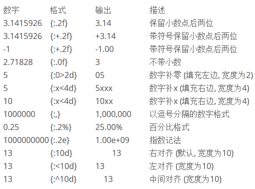

>所以你施舍的时候，不可在你前面吹号，像那假冒为善的人，在会堂里和街道上所行的，故意要得人的荣耀。我实在告诉你们，他们已经得了他们的上次。你施舍的时候，不要叫左手知道右手所作的。要叫你施舍的事行在暗中，你父在暗中察看，必然报答你。(MATTHEW 6:2-4)

#字符串(4)

字符串的内容的确不少，甚至都有点啰嗦了。但是，本节依然还要继续，就是因为在编程实践中，经常会遇到有关字符串的问题，而且也是很多初学者容易迷茫的。

##字符串格式化输出

什么是格式化？在维基百科中有专门的词条，这么说的：

>格式化是指对磁盘或磁盘中的分区（partition）进行初始化的一种操作，这种操作通常会导致现有的磁盘或分区中所有的文件被清除。

不知道你是否知道这种“格式化”。显然，此格式化非我们这里所说的，我们说的是字符串的格式化，或者说成“格式化字符串”，都可以，表示的意思就是：

>格式化字符串，是C、C++等程序设计语言printf类函数中用于指定输出参数的格式与相对位置的字符串参数。其中的转换说明（conversion specification）用于把随后对应的0个或多个函数参数转换为相应的格式输出；格式化字符串中转换说明以外的其它字符原样输出。

这也是来自维基百科的定义。在这个定义中，是用C语言作为例子，并且用了其输出函数来说明。在python中，也有同样的操作和类似的函数`print`，此前我们已经了解一二了。

如果将那个定义说的通俗一些，字符串格式化化，就是要先制定一个模板，在这个模板中某个或者某几个地方留出空位来，然后在那些空位填上字符串。那么，那些空位，需要用一个符号来表示，这个符号通常被叫做占位符（仅仅是占据着那个位置，并不是输出的内容）。

    >>> "I like %s"
    'I like %s'

在这个字符串中，有一个符号：`%s`，就是一个占位符，这个占位符可以被其它的字符串代替。比如：

	>>> "I like %s" % "python"
    'I like python'
    >>> "I like %s" % "Pascal"
    'I like Pascal'
	
这是较为常用的一种字符串输出方式。

另外，不同的占位符，会表示那个位置应该被不同类型的对象填充。下面列出许多，供参考。不过，不用记忆，常用的只有`%s`和`%d`，或者再加上`%f`，其它的如果需要了，到这里来查即可。

占位符|说明
------|---
%s   |字符串(采用str()的显示)
%r   |字符串(采用repr()的显示)
%c   |单个字符
%b   |二进制整数
%d   |十进制整数
%i   |十进制整数
%o   |八进制整数
%x   |十六进制整数
%e   |指数 (基底写为e)
%E   |指数 (基底写为E)
%f   |浮点数
%F   |浮点数，与上相同
%g   |指数(e)或浮点数 (根据显示长度)
%G   |指数(E)或浮点数 (根据显示长度)

看例子：

    >>> a = "%d years" % 15
    >>> print a
    15 years

当然，还可以在一个字符串中设置多个占位符，就像下面一样

	>>> print "Suzhou is more than %d years. %s lives in here." % (2500, "qiwsir")
    Suzhou is more than 2500 years. qiwsir lives in here.
	
对于浮点数字的打印输出，还可以限定输出的小数位数和其它样式。

    >>> print "Today's temperature is %.2f" % 12.235
    Today's temperature is 12.23
    >>> print "Today's temperature is %+.2f" % 12.235
    Today's temperature is +12.23

注意，上面的例子中，没有实现四舍五入的操作，貌似只是截取。其实，我在这里用的那个12.235的确有点特殊化了。你不妨修改为别的数，试一试，看看是不是四舍五入了。至于这个数的特殊性，如果你不能理解，就请回头找一找本教程中关于十进制与二进制数转换的讲述。

关于类似的操作，还有很多变化，比如输出格式要宽度是多少等等。如果看官在编程中遇到了，可以到网上查找。我这里给一个参考图示，也是从网上抄来的。

其实，上面这种格式化方法，常常被认为是太“古老”了。因为在python中还有新的格式化方法。

    >>> s1 = "I like {0}".format("python")
    >>> s1
    'I like python'
    >>> s2 = "Suzhou is more than {0} years. {1} lives in here.".format(2500, "qiwsir") 
    >>> s2
    'Suzhou is more than 2500 years. qiwsir lives in here.'

这就是python非常提倡的`string.format()`的格式化方法，其中`{索引值}`作为占位符，

这种方法真的是非常好，而且非常简单，只需要将对应的东西，按照顺序在format后面的括号中排列好，分别对应占位符`{}`即可。我喜欢的方法。

如果你觉得还不明确，还可以这样来做。

    >>> print "Suzhou is more than {year} years. {name} lives in here.".format(year=2500, name="qiwsir") 
    Suzhou is more than 2500 years. qiwsir lives in here.
	
真的很简洁，看成优雅。

其实，还有一种格式化的方法，被称为“字典格式化”，这里仅仅列一个例子，如果看官要了解字典的含义，本教程后续会有的。

    >>> lang = "python"
    >>> print "I love %(program)s"%{"program":lang}
    I love python

列举了三种基本格式化的方法，你喜欢那种？我推荐：`string.format()`

##常用的字符串方法

字符串的方法很多。可以通过dir来查看：

    >>> dir(str)
    ['__add__', '__class__', '__contains__', '__delattr__', '__doc__', '__eq__', '__format__', '__ge__', '__getattribute__', '__getitem__', '__getnewargs__', '__getslice__', '__gt__', '__hash__', '__init__', '__le__', '__len__', '__lt__', '__mod__', '__mul__', '__ne__', '__new__', '__reduce__', '__reduce_ex__', '__repr__', '__rmod__', '__rmul__', '__setattr__', '__sizeof__', '__str__', '__subclasshook__', '_formatter_field_name_split', '_formatter_parser', 'capitalize', 'center', 'count', 'decode', 'encode', 'endswith', 'expandtabs', 'find', 'format', 'index', 'isalnum', 'isalpha', 'isdigit', 'islower', 'isspace', 'istitle', 'isupper', 'join', 'ljust', 'lower', 'lstrip', 'partition', 'replace', 'rfind', 'rindex', 'rjust', 'rpartition', 'rsplit', 'rstrip', 'split', 'splitlines', 'startswith', 'strip', 'swapcase', 'title', 'translate', 'upper', 'zfill']

这么多，不会一一介绍，要了解某个具体的含义和使用方法，最好是使用help查看。举例：

    >>> help(str.isalpha)

    Help on method_descriptor:

    isalpha(...)
        S.isalpha() -> bool
    
        Return True if all characters in S are alphabetic
        and there is at least one character in S, False otherwise.

按照这里的说明，就可以在交互模式下进行实验。

    >>> "python".isalpha()    #字符串全是字母，应该返回True
    True
    >>> "2python".isalpha()    #字符串含非字母，返回False
    False

###split

这个函数的作用是将字符串根据某个分割符进行分割。

    >>> a = "I LOVE PYTHON"
    >>> a.split(" ")
    ['I', 'LOVE', 'PYTHON']
	
这是用空格作为分割，得到了一个名字叫做列表（list）的返回值，关于列表的内容，后续会介绍。还能用别的分隔吗？

    >>> b = "www.itdiffer.com"
    >>> b.split(".")
    ['www', 'itdiffer', 'com']

###去掉字符串两头的空格

这个功能，在让用户输入一些信息的时候非常有用。有的朋友喜欢输入结束的时候敲击空格，比如让他输入自己的名字，输完了，他来个空格。有的则喜欢先加一个空格，总做的输入的第一个字前面应该空两个格。

这些空格是没用的。python考虑到有不少人可能有这个习惯，因此就帮助程序员把这些空格去掉。

方法是：

- S.strip()     去掉字符串的左右空格
- S.lstrip()    去掉字符串的左边空格
- S.rstrip()    去掉字符串的右边空格

例如：

    >>> b=" hello "    #两边有空格
    >>> b.strip()
    'hello'
    >>> b
    ' hello '
	
特别注意，原来的值没有变化，而是新返回了一个结果。

    >>> b.lstrip()    #去掉左边的空格
    'hello '
    >>> b.rstrip()    #去掉右边的空格
    ' hello'

###字符大小写的转换

对于英文，有时候要用到大小写转换。最有名驼峰命名，里面就有一些大写和小写的参合。如果有兴趣，可以来这里看[自动将字符串转化为驼峰命名形式的方法](https://github.com/qiwsir/algorithm/blob/master/string_to_hump.md)。

在python中有下面一堆内建函数，用来实现各种类型的大小写转化

- S.upper()         #S中的字母大写
- S.lower()         #S中的字母小写
- S.capitalize()    #首字母大写
- S.isupper()       #S中的字母是否全是大写
- S.islower()       #S中的字母是否全是小写 
- S.istitle()	    #S中字符串中所有的单词拼写首字母是否为大写，且其他字母为小写

看例子：

    >>> a = "qiwsir,python" 
    >>> a.upper()       #将小写字母完全变成大写字母
    'QIWSIR,PYTHON'
    >>> a               #原数据对象并没有改变
    'qiwsir,python'
    >>> b = a.upper()
    >>> b
    'QIWSIR,PYTHON'
    >>> c = b.lower()   #将所有的小写字母变成大写字母
    >>> c
    'qiwsir,python'

    >>> a
    'qiwsir,python'
    >>> a.capitalize()  #把字符串的第一个字母变成大写
    'Qiwsir,python'
    >>> a               #原数据对象没有改变
    'qiwsir,python'
    >>> b = a.capitalize() #新建立了一个
    >>> b
    'Qiwsir,python'

    >>> a = "qiwsir,github"    #这里的问题就是网友白羽毛指出的，非常感谢他。
    >>> a.istitle()
    False
    >>> a = "QIWSIR"        #当全是大写的时候，返回False
    >>> a.istitle()
    False
    >>> a = "qIWSIR"
    >>> a.istitle()
    False
    >>> a = "Qiwsir,github"  #如果这样，也返回False
    >>> a.istitle()
    False
    >>> a = "Qiwsir"        #这样是True
    >>> a.istitle()
    True
    >>> a = 'Qiwsir,Github' #这样也是True
    >>> a.istitle()
    True

    >>> a = "Qiwsir"
    >>> a.isupper()
    False
    >>> a.upper().isupper()
    True
    >>> a.islower()
    False
    >>> a.lower().islower()
    True

顺着白羽毛网友指出的，再探究一下，可以这么做：

    >>> a = "This is a Book"
    >>> a.istitle()
    False
    >>> b = a.title()     #这样就把所有单词的第一个字母转化为大写
    >>> b
    'This Is A Book'
    >>> b.istitle()       #判断每个单词的第一个字母是否为大写
    True

###join拼接字符串

用“+”能够拼接字符串，但不是什么情况下都能够如愿的。比如，将列表（关于列表，后续详细说，它是另外一种类型）中的每个字符（串）元素拼接成一个字符串，并且用某个符号连接，如果用“+”，就比较麻烦了（是能够实现的，麻烦）。

用字符串的join就比较容易实现。

    >>> b
    'www.itdiffer.com'
    >>> c = b.split(".")
    >>> c
    ['www', 'itdiffer', 'com']
    >>> ".".join(c)
    'www.itdiffer.com'
    >>> "*".join(c)
    'www*itdiffer*com'

这种拼接，是不是简单呢？

------

[总目录](./index.md)&nbsp;&nbsp;&nbsp;|&nbsp;&nbsp;&nbsp;[上节：字符串(3)](./108.md)&nbsp;&nbsp;&nbsp;|&nbsp;&nbsp;&nbsp;[下节：字符编码](./110.md)

如果你认为有必要打赏我，请通过支付宝：**qiwsir@126.com**,不胜感激。
