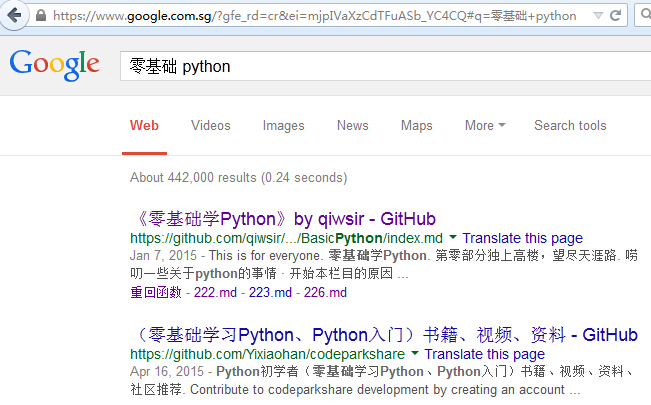

>弟兄们，我不是以为自己已经得着了，我只有一件事，就是忘记背后，努力面前的，向着标杆直跑，要得神在基督耶稣里从上面召我来得的奖赏。(PHILIPPIANS 3:13-14)

#标准库(6)

##urllib

`urllib`模块用于读取来自网上（服务器上）的数据，比如不少人用Python做爬虫程序，就可以使用这个模块。先看一个简单例子：

在Python 2中，这样操作：

    >>> import urllib
    >>> itdiffer =  urllib.urlopen("http://www.itdiffer.com")

但是如果读者使用的是Python 3，必须换个姿势：

    >>> import urllib.request
    >>> itdiffer = urllib.request.urlopen("http://www.itdiffer.com")
    
这样就已经把我的网站[www.itdiffer.com](http://www.itdiffer.com)首页的内容拿过来了，得到了一个类似文件的对象。接下来的操作跟操作一个文件一样。

    >>> print itdiffer.read()        #Python 3: print(itdiffer.read())
    <!DOCTYPE HTML>
    <html>
    	<head>
    		<title>I am Qiwsir</title>
    ....//因为内容太多，下面就省略了
    
这样就完成了对网页的抓取。当然，如果你真的要做爬虫程序，还不是仅仅如此。这里不介绍爬虫程序如何编写，仅说明`urllib`模块的常用属性和方法。

Python 2:

    >>> dir(urllib)
    ['ContentTooShortError', 'FancyURLopener', 'MAXFTPCACHE', 'URLopener', '__all__', '__builtins__', '__doc__', '__file__', '__name__', '__package__', '__version__', '_asciire', '_ftperrors', '_have_ssl', '_hexdig', '_hextochr', '_hostprog', '_is_unicode', '_localhost', '_noheaders', '_nportprog', '_passwdprog', '_portprog', '_queryprog', '_safe_map', '_safe_quoters', '_tagprog', '_thishost', '_typeprog', '_urlopener', '_userprog', '_valueprog', 'addbase', 'addclosehook', 'addinfo', 'addinfourl', 'always_safe', 'base64', 'basejoin', 'c', 'ftpcache', 'ftperrors', 'ftpwrapper', 'getproxies', 'getproxies_environment', 'i', 'localhost', 'noheaders', 'os', 'pathname2url', 'proxy_bypass', 'proxy_bypass_environment', 'quote', 'quote_plus', 're', 'reporthook', 'socket', 'splitattr', 'splithost', 'splitnport', 'splitpasswd', 'splitport', 'splitquery', 'splittag', 'splittype', 'splituser', 'splitvalue', 'ssl', 'string', 'sys', 'test1', 'thishost', 'time', 'toBytes', 'unquote', 'unquote_plus', 'unwrap', 'url2pathname', 'urlcleanup', 'urlencode', 'urlopen', 'urlretrieve']

Python 3:

    >>> dir(urllib.request)
    ['AbstractBasicAuthHandler', 'AbstractDigestAuthHandler', 'AbstractHTTPHandler', 'BaseHandler', 'CacheFTPHandler', 'ContentTooShortError', 'DataHandler', 'FTPHandler', 'FancyURLopener', 'FileHandler', 'HTTPBasicAuthHandler', 'HTTPCookieProcessor', 'HTTPDefaultErrorHandler', 'HTTPDigestAuthHandler', 'HTTPError', 'HTTPErrorProcessor', 'HTTPHandler', 'HTTPPasswordMgr', 'HTTPPasswordMgrWithDefaultRealm', 'HTTPPasswordMgrWithPriorAuth', 'HTTPRedirectHandler', 'HTTPSHandler', 'MAXFTPCACHE', 'OpenerDirector', 'ProxyBasicAuthHandler', 'ProxyDigestAuthHandler', 'ProxyHandler', 'Request', 'URLError', 'URLopener', 'UnknownHandler', '__all__', '__builtins__', '__cached__', '__doc__', '__file__', '__loader__', '__name__', '__package__', '__spec__', '__version__', '_cut_port_re', '_ftperrors', '_have_ssl', '_localhost', '_noheaders', '_opener', '_parse_proxy', '_proxy_bypass_macosx_sysconf', '_randombytes', '_safe_gethostbyname', '_thishost', '_url_tempfiles', 'addclosehook', 'addinfourl', 'base64', 'bisect', 'build_opener', 'collections', 'contextlib', 'email', 'ftpcache', 'ftperrors', 'ftpwrapper', 'getproxies', 'getproxies_environment', 'getproxies_registry', 'hashlib', 'http', 'install_opener', 'io', 'localhost', 'noheaders', 'os', 'parse_http_list', 'parse_keqv_list', 'pathname2url', 'posixpath', 'proxy_bypass', 'proxy_bypass_environment', 'proxy_bypass_registry', 'quote', 're', 'request_host', 'socket', 'splitattr', 'splithost', 'splitpasswd', 'splitport', 'splitquery', 'splittag', 'splittype', 'splituser', 'splitvalue', 'ssl', 'sys', 'tempfile', 'thishost', 'time', 'to_bytes', 'unquote', 'unquote_to_bytes', 'unwrap', 'url2pathname', 'urlcleanup', 'urljoin', 'urlopen', 'urlparse', 'urlretrieve', 'urlsplit', 'urlunparse', 'warnings']
    
选几个常用的介绍，如果读者用到其它的，可以通过查看文档了解。

**urlopen()**

`urlopen()`主要用于打开url文件，然后就获得指定url的数据，然后就如同在操作文件那样来操作。

    Help on function urlopen in module urllib:

    urlopen(url, data=None, proxies=None)
        Create a file-like object for the specified URL to read from.

查看文档信息，在Python 2下使用`help(urllib.urlopen)`，在Python 3下使用`help(urllib.request.urlopen)`。两者查询结果略有差异，上述显示的是Python 2下的查询结果。
        
得到的对象被叫做类文件。从名字中也可以理解后面的操作了。先对参数说明一下：

- url：远程数据的路径，常常是网址
- data：如果使用post方式，这里就是所提交的数据
- proxies：设置代理

关于参数的详细说明，还可以参考[Python的官方文档](https://docs.python.org/2/library/urllib.html)，这里仅演示最常用的，如前面的例子那样。

当得到了类文件对象之后，即变量`itdiffer`引用了得到的类文件对象，依然可以用老办法`dir(itdiffer)`查看它的属性和方法，但在不同的Python版本下，显示结果是有所不同的，区别的原因是两个版本对文件对象的不同处理。

简单举例：

    >>> itdiffer.info()
    <httplib.HTTPMessage instance at 0xb6eb3f6c>
    >>> itdiffer.getcode()
    200
    >>> itdiffer.geturl()
    'http://www.itdiffer.com'

更多情况下，已经建立了类文件对象，通过对文件操作方法，获得想要的数据。
    
**对url编码、解码**

url对其中的字符有严格的编码要求，要对url进行编码和解码。在进行web开发的时候特别要注意。`urllib`或者`urllib.request`模块提供这种功能。

- quote(string[, safe])：对字符串进行编码。参数safe指定了不需要编码的字符
- urllib.unquote(string) ：对字符串进行解码
- quote_plus(string [ , safe ] ) ：与urllib.quote类似，但这个方法用'+'来替换空格`' '`，而quote用'%20'来代替空格
- unquote_plus(string ) ：对字符串进行解码；
- urllib.urlencode(query[, doseq])：将dict或者包含两个元素的元组列表转换成url参数。例如{'name': 'laoqi', 'age': 40}将被转换为"name=laoqi&age=40"
- pathname2url(path)：将本地路径转换成url路径
- url2pathname(path)：将url路径转换成本地路径

看例子就更明白了。下面的操作是在Python 2中进行的，

    >>> du = "http://www.itdiffer.com/name=python book"
    >>> urllib.quote(du) 
    'http%3A//www.itdiffer.com/name%3Dpython%20book'
    >>> urllib.quote_plus(du)
    'http%3A%2F%2Fwww.itdiffer.com%2Fname%3Dpython+book'

如果是Python 3的读者，请注意，该方法不在前述所引用的`urllib.request`中，尽管它里面有`quote()`方法，但最好的操作是`import urllib.parrse`，所以，Python 3下应该这么操作：

    >>> import urllib.parse
    >>> du = 'http://www.itdiffer.com/name=python book'
    >>> urllib.parse.quote(du)
    'http%3A//www.itdiffer.com/name%3Dpython%20book'
    >>> urllib.parse.quote_plus(du)
    'http%3A%2F%2Fwww.itdiffer.com%2Fname%3Dpython+book'
    
注意看空格的变化，一个被编码成`%20`，另外一个是`+`

再看解码的，假如在google中搜索`零基础 python`，结果如下图：

我的教程可是在这次搜索中排列第一个哦。

这不是重点，重点是看url，它就是用`+`替代空格了。

Python 2:

    >>> dup = urllib.quote_plus(du)
    >>> urllib.unquote_plus(dup)
    'http://www.itdiffer.com/name=python book'

Python 3:

    >>> dup = urllib.parse.quote_plus(du)
    >>> urllib.parse.unquote_plus(dup)
    'http://www.itdiffer.com/name=python book'
    
从解码效果来看，比较完美地逆过程。

Python 2:

    >>> urllib.urlencode({"name":"qiwsir","web":"itdiffer.com"})
    'web=itdiffer.com&name=qiwsir'

Python 3:

    >>> urllib.parse.urlencode({"name":"qiwsir","web":"itdiffer.com"})
    'name=qiwsir&web=itdiffer.com'
    
如果将来你要做一个网站，上面的方法或许会用到。

**urlretrieve()**

虽然urlopen()能够建立类文件对象，但是，那还不等于将远程文件保存在本地存储器中，`urlretrieve()`就是满足这个需要的。先看实例。

以下是在Python 2中的操作：

    >>> import urllib
    >>> urllib.urlretrieve("http://www.itdiffer.com/images/me.jpg", "me.jpg")
    ('me.jpg', <httplib.HTTPMessage instance at 0xb6ecb6cc>)

如果在Python 3中，则要使用`urllib.request`：

    >>> import urllib.request
    >>> urllib.request.urlretrieve("http://www.itdiffer.com/images/me.jpg", "me.jpg")
    ('me.jpg', <http.client.HTTPMessage object at 0x000000000395A160>)

`me.jpg`是一张存在于服务器上的图片，地址是：http://www.itdiffer.com/images/me.jpg，把它保存到本地存储器中，并且仍旧命名为me.jpg。注意，如果只写这个名字，表示存在启动Python交互模式的那个目录中，否则，可以指定存储具体目录和文件名。

在urllib官方文档（[Python 2文档](https://docs.python.org/2/library/urllib.html)，[Python 3文档](https://docs.python.org/3/library/urllib.html)）中有一大段相关说明，读者可以去认真阅读。这里仅简要介绍一下相关参数。

`urllib.urlretrieve(url[, filename[, reporthook[, data]]])`

- url：文件所在的网址
- filename：可选。将文件保存到本地的文件名，如果不指定，urllib会生成一个临时文件来保存
- reporthook：可选。是回调函数，当链接服务器和相应数据传输完毕时触发本函数
- data：可选。如果用post方式所发出的数据

函数执行完毕，返回的结果是一个元组(filename, headers)，filename是保存到本地的文件名，headers是服务器响应头信息。

    #!/usr/bin/env python
    # coding=utf-8

    import urllib
    #Python 3
    #import urllib.request

    def go(a,b,c):
        per = 100.0 * a * b / c
        if per > 100:
            per = 100
        print "%.2f%%" % per

    url = "http://ww2.sinaimg.cn/mw690/8e4023f8gw1f34gs20b4ij20qo0zkthw.jpg"
    local = "/home/qw/Pictures/g.jpg"
    urllib.urlretrieve(url, local, go)
    #Python 3
    #urllib.request.urlrretrieve(url, local, go)

这段程序就是要下载指定的图片，并且保存为本地指定位置的文件，同时要显示下载的进度。上述文件保存之后执行，显示如下效果：

    $ python 22501.py 
    0.00%
    8.13%
    16.26%
    24.40%
    32.53%
    40.66%
    48.79%
    56.93%
    65.06%
    73.19%
    81.32%
    89.46%
    97.59%
    100.00%

到相应目录中查看，能看到与网上地址一样的文件。我这里就不对结果截图了，读者自行查看（或许在本书出版的时候，这张什么的图片已经看不到了，你应该把这视为正常现象，可以换一张图片地址）。

##urllib2

urllib2是另外一个模块，它跟urllib有相似的地方——都是对url相关的操作，也有不同的地方。关于这方面，有一篇文章讲的不错：[Python: difference between urllib and urllib2](http://www.hacksparrow.com/python-difference-between-urllib-and-urllib2.html)

我选取一段，供大家参考：

>urllib2 can accept a Request object to set the headers for a URL request, urllib accepts only a URL. That means, you cannot masquerade your User Agent string etc.

>urllib provides the urlencode method which is used for the generation of GET query strings, urllib2 doesn't have such a function. This is one of the reasons why urllib is often used along with urllib2.

所以，有时候两个要同时使用，urllib模块和urllib2模块有的方法可以相互替代，有的不能。看下面的属性方法列表就知道了。

    >>> dir(urllib2)
    ['AbstractBasicAuthHandler', 'AbstractDigestAuthHandler', 'AbstractHTTPHandler', 'BaseHandler', 'CacheFTPHandler', 'FTPHandler', 'FileHandler', 'HTTPBasicAuthHandler', 'HTTPCookieProcessor', 'HTTPDefaultErrorHandler', 'HTTPDigestAuthHandler', 'HTTPError', 'HTTPErrorProcessor', 'HTTPHandler', 'HTTPPasswordMgr', 'HTTPPasswordMgrWithDefaultRealm', 'HTTPRedirectHandler', 'HTTPSHandler', 'OpenerDirector', 'ProxyBasicAuthHandler', 'ProxyDigestAuthHandler', 'ProxyHandler', 'Request', 'StringIO', 'URLError', 'UnknownHandler', '__builtins__', '__doc__', '__file__', '__name__', '__package__', '__version__', '_cut_port_re', '_opener', '_parse_proxy', '_safe_gethostbyname', 'addinfourl', 'base64', 'bisect', 'build_opener', 'ftpwrapper', 'getproxies', 'hashlib', 'httplib', 'install_opener', 'localhost', 'mimetools', 'os', 'parse_http_list', 'parse_keqv_list', 'posixpath', 'proxy_bypass', 'quote', 'random', 'randombytes', 're', 'request_host', 'socket', 'splitattr', 'splithost', 'splitpasswd', 'splitport', 'splittag', 'splittype', 'splituser', 'splitvalue', 'sys', 'time', 'toBytes', 'unquote', 'unwrap', 'url2pathname', 'urlopen', 'urlparse', 'warnings']

比较常用的比如`urlopen()`跟`urllib.urlopen()`是完全类似的。

但是，要注意，上述言论仅仅是针对Python 2的，在Python 3中，已经没有`urllib2`这个模块了，取代它的是`urllib.request`。

**Request类**

正如前面区别urllib和urllib2所讲，利用urllib2模块可以建立一个Request对象。方法就是：

Python 2:

    >>> req = urllib2.Request("http://www.itdiffer.com")

Python 3:

    >>> import urllib.request
    >>> req = urllib.request.Request("http://www.itdiffer.com")

建立了Request对象之后，它的最直接应用就是可以作为`urlopen()`方法的参数

Python 2:

    >>> response = urllib2.urlopen(req)
    >>> page = response.read()
    >>> print page

Python 3:

    >>> response = urllib.request.urlopen(req)
    >>> page = response.read()
    >>> print(page)

显示结果从略。但是，如果Request对象仅仅局限于此，似乎还没有什么太大的优势。因为刚才的访问仅仅是满足以get方式请求页面，并建立类文件对象。如果是通过post向某地址提交数据，也可以建立Request对象。

Python 2:

    import urllib    
    import urllib2    
      
    url = 'http://www.itdiffer.com/register.py'    
        
    values = {'name' : 'qiwsir', 'location' : 'China', 'language' : 'Python' }    
      
    data = urllib.urlencode(values)     # 编码  
    req = urllib2.Request(url, data)    # 发送请求同时传data表单  
    response = urllib2.urlopen(req)     #接受反馈的信息  
    the_page = response.read()          #读取反馈的内容

Python 3:

    import urllib.request    
    import urllib.parse
      
    url = 'http://www.itdiffer.com/register.py'    
        
    values = {'name' : 'qiwsir', 'location' : 'China', 'language' : 'Python' }    
      
    data = urllib.parse.urlencode(values)     # 编码  
    req = urllib.request.Request(url, data)    # 发送请求同时传data表单  
    response = urllib.request.urlopen(req)     #接受反馈的信息  
    the_page = response.read()          #读取反馈的内容

如果读者照抄上面的程序，然后运行代码，肯定报错。因为那个url中没有相应的接受客户端post上去的data的程序文件，为了让程序运行，读者可以开发接受数据的程序。上面的代码只是以一个例子来显示Request对象的另外一个用途，并且在这个例子中是以post方式提交数据。

在网站中，有的会通过User-Agent来判断访问者是浏览器还是别的程序，如果通过别的程序访问，它有可能拒绝。这时候，我们编写程序去访问，就要设置headers了。设置方法是：

    user_agent = 'Mozilla/4.0 (compatible; MSIE 5.5; Windows NT)'
    headers = { 'User-Agent' : user_agent }

然后重新建立Request对象：

    req = urllib2.Request(url, data, headers)    #Python 3: req = urllib.request.Request(url, data, headers)

再用·urlopen()·方法访问：

    response = urllib2.urlopen(req)        #Python 3: response = urllib.request.urlopen(req) 

除了上面演示之外，`urllib2`或者`urllib.request`的东西还很多，比如还可以:

- 设置HTTP Proxy
- 设置Timeout值
- 自动redirect
- 处理cookie

等等。这些内容不再一一介绍，当需要用到的时候可以查看文档或者google。

------

[总目录](./index.md)&nbsp;&nbsp;&nbsp;|&nbsp;&nbsp;&nbsp;[上节：标准库(5)](./224.md)&nbsp;&nbsp;&nbsp;|&nbsp;&nbsp;&nbsp;[下节：标准库(7)](./226.md)

如果你认为有必要打赏我，请通过支付宝：**qiwsir@126.com**,不胜感激。
