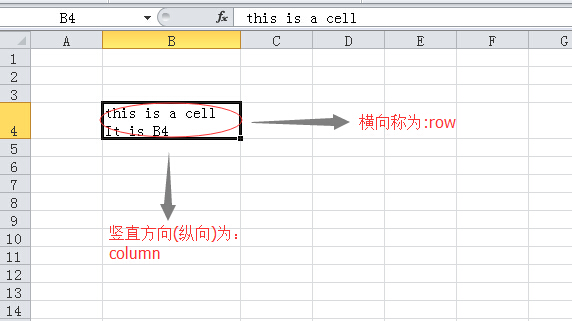
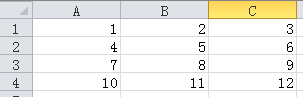

>人若自洁，脱离卑贱的事，就必作贵重的器皿，成为圣洁，合乎主用，预备行各样的善事。你要逃避少年的私欲，同那清心祷告主的人追求公义、信德、仁爱、和平。惟有那愚拙无学问的辩论，总要弃绝，因为知道这等事是起争竞的。(2 TIMOTHY 2:21-23)

#电子表格

一提到电子表格，可能立刻想到的是excel。殊不知，电子表格，还是“历史悠久”的呢，比word要长久多了。根据维基百科的记载整理一个简史：

>VisiCalc是第一个电子表格程序，用于苹果II型电脑。由丹·布李克林（Dan Bricklin）和鮑伯·法蘭克斯頓（Bob Frankston）發展而成，1979年10月跟著蘋果二號電腦推出，成為蘋果二號電腦上的「殺手應用軟體」。

>接下来是Lotus 1-2-3，由Lotus Software（美國蓮花軟體公司）於1983年起所推出的電子試算表軟體，在DOS時期廣為個人電腦使用者所使用，是一套殺手級應用軟體。也是世界上第一个销售超过100万套的软件。

>然后微软也开始做电子表格，早在1982年，它推出了它的第一款電子制表軟件──Multiplan，並在CP/M系統上大獲成功，但在MS-DOS系統上，Multiplan敗給了Lotus 1-2-3。

>1985年，微软推出第一款Excel，但它只用於Mac系統；直到1987年11月，微软的第一款適用於Windows系統的Excel才诞生，不过，它一出来，就与Windows系统直接捆綁，由于此后windows大行其道，并且Lotus1-2-3遲遲不能適用於Windows系統，到了1988年，Excel的銷量超過了1-2-3。

>此后就是微软的天下了，Excel后来又并入了Office里面，成为了Microsoft Office Excel。

>尽管Excel已经发展了很多代，提供了大量的用戶界面特性，但它仍然保留了第一款電子制表軟件VisiCalc的特性：行、列組成單元格，數據、與數據相關的公式或者對其他單元格的絕對引用保存在單元格中。

>由于微软独霸天下，Lotus 1-2-3已经淡出了人们的视线，甚至于误认为历史就是从微软开始的。

>其实，除了微软的电子表格，在Linux系统中也有很好的电子表格，google也提供了不错的在线电子表格（可惜某国内不能正常访问）。

从历史到现在，电子表格都很广泛的用途。所以，python也要操作一番电子表格，因为有的数据，或许就是存在电子表格中。

##openpyl

openpyl模块是解决Microsoft Excel 2007/2010之类版本中扩展名是Excel 2010 xlsx/xlsm/xltx/xltm的文件的读写的第三方库。（差点上不来气，这句话太长了。）

###安装

安装第三方库，当然用法力无边的pip install

    $ sudo pip install openpyxl
    
如果最终看到下面的提示，恭喜你，安装成功。

    Successfully installed openpyxl jdcal
    Cleaning up...

###workbook和sheet

第一步，当然是要引入模块，用下面的方式：

    >>> from openpyxl import Workbook

接下来就用`Workbook()`类里面的方法展开工作：

    >>> wb = Workbook()

请回忆Excel文件，如果想不起来，就打开Excel，我们第一眼看到的是一个称之为工作簿(workbook)的东西，里面有几个sheet，默认是三个，当然可以随意增删。默认又使用第一个sheet。

    >>> ws = wb.active

每个工作簿中，至少要有一个sheet，通过这条指令，就在当前工作簿中建立了一个sheet，并且它是当前正在使用的。

还可以在这个sheet后面追加：

    >>> ws1 = wb.create_sheet()

甚至，还可以加塞：

    >>> ws2 = wb.create_sheet(1)

排在了第二个位置。

在Excel文件中一样，创建了sheet之后，默认都是以"Sheet1"、"Sheet2"样子来命名的，然后我们可以给其重新命名。在这里，依然可以这么做。

    >>> ws.title = "python"
    
ws所引用的sheet对象名字就是"python"了。

此时，可以使用下面的方式从工作簿对象中得到sheet

    >>> ws01 = wb['python']    #sheet和工作簿的关系，类似键值对的关系
    >>> ws is ws01
    True

或者用这种方式
    
    >>> ws02 = wb.get_sheet_by_name("python")    #这个方法名字也太直接了，方法的参数就是sheet名字
    >>> ws is ws02
    True

整理一下到目前为止我们已经完成的工作：建立了工作簿(wb)，还有三个sheet。还是显示一下比较好：

    >>> print wb.get_sheet_names()
    ['python', 'Sheet2', 'Sheet1']

Sheet2这个sheet之所以排在了第二位，是因为在建立的时候，用了一个加塞的方法。这跟Excel中差不多少，如果sheet命名了，就按照那个名字显示，否则就默认为名字是"Sheet1"形状的（注意，第一个字母大写）。

也可以用循环语句，把所有的sheet名字打印出来。

    >>> for sh in wb:
    ...     print sh.title
    ... 
    python
    Sheet2
    Sheet1

如果读者去`dir(wb)`工作簿对象的属性和方法，会发现它具有迭代的特征`__iter__`方法。说明，工作簿是可迭代的。

###cell

为了能够清楚理解填数据的过程，将电子表中约定的名称以下图方式说明：

对于sheet，其中的cell是它的下级单位。所以，要得到某个cell，可以这样：

    b4 = ws['B4']

如果B4这个cell已经有了，用这种方法就是将它的值赋给了变量b4；如果sheet中没有这个cell，那么就创建这个cell对象。

请读者注意，当我们打开Excel，默认已经画好了好多cell。但是，在python操作的电子表格中，不会默认画好那样一个表格，一切都要创建之后才有。所以，如果按照前面的操作流程，上面就是创建了B4这个cell，并且把它作为一个对象被b4变量引用。

如果要给B4添加数据，可以这么做：

    >>> ws['B4'] = 4444
    
因为b4引用了一个cell对象，所以可以利用这个对象的属性来查看其值：

    >>> b4.value
    4444

要获得（或者建立并获得）某个cell对象，还可以使用下面方法：

    >>> a1 = ws.cell("A1")
    
或者：

    >>> a2 = ws.cell(row = 2, column = 1)

刚才已经提到，在建立了sheet之后，内存中的它并没有cell，需要程序去建立。上面都是一个一个地建立，能不能一下建立多个呢？比如要类似下面的：

|A1|B1|C1|
|A2|B2|C2|
|A3|B3|C3|

就可以如同切片那样来操作：

    >>> cells = ws["A1":"C3"]

可以用下面方法看看创建结果：

    >>> tuple(ws.iter_rows("A1:C3"))
    ((<Cell python.A1>, <Cell python.B1>, <Cell python.C1>), 
     (<Cell python.A2>, <Cell python.B2>, <Cell python.C2>), 
     (<Cell python.A3>, <Cell python.B3>, <Cell python.C3>))

这是按照横向顺序数过来来的，即A1-B1-C1，然后下一横行。还可以用下面的循环方法，一个一个地读到每个cell对象：

    >>> for row in ws.iter_rows("A1:C3"):
    ...     for cell in row:
    ...         print cell
    ... 
    <Cell python.A1>
    <Cell python.B1>
    <Cell python.C1>
    <Cell python.A2>
    <Cell python.B2>
    <Cell python.C2>
    <Cell python.A3>
    <Cell python.B3>
    <Cell python.C3>

也可以用sheet对象的`rows`属性，得到按照横向顺序依次排列的cell对象（注意观察结果，因为没有进行范围限制，所以是目前sheet中所有的cell，前面已经建立到第四行了B4，所以，要比上面的操作多一个row）：
    
    >>> ws.rows
    ((<Cell python.A1>, <Cell python.B1>, <Cell python.C1>), 
     (<Cell python.A2>, <Cell python.B2>, <Cell python.C2>), 
     (<Cell python.A3>, <Cell python.B3>, <Cell python.C3>), 
     (<Cell python.A4>, <Cell python.B4>, <Cell python.C4>))

用sheet对象的`columns`属性，得到的是按照纵向顺序排列的cell对象（注意观察结果）：

    >>> ws.columns
    ((<Cell python.A1>, <Cell python.A2>, <Cell python.A3>, <Cell python.A4>), 
     (<Cell python.B1>, <Cell python.B2>, <Cell python.B3>, <Cell python.B4>), 
     (<Cell python.C1>, <Cell python.C2>, <Cell python.C3>, <Cell python.C4>))

不管用那种方法，只要得到了cell对象，接下来就可以依次赋值了。比如要将上面的表格中，依次填写上1,2,3,...

    >>> i = 1
    >>> for cell in ws.rows:
    ...     cell.value = i
    ...     i += 1
   ... 
    Traceback (most recent call last):
      File "<stdin>", line 2, in <module>
    AttributeError: 'tuple' object has no attribute 'value'

报错了。什么错误。关键就是没有注意观察上面的结果。tuple里面是以tuple为元素，再里面才是cell对象。所以，必须要“时时警醒”，常常谨慎。
    
    >>> for row in ws.rows:
    ...     for cell in row:
    ...         cell.value = i
    ...         i += 1
    ... 

如此，就给每个cell添加了数据。查看一下，不过要换一个属性：

    >>> for col in ws.columns:
    ...     for cell in col:
    ...         print cell.value
    ... 
    1
    4
    7
    10
    2
    5
    8
    11
    3
    6
    9
    12

虽然看着有点不舒服，但的确达到了前面的要求。

###保存

把辛苦工作的结果保存一下吧。

    >>> wb.save("23401.xlsx")

如果有同名文件存在，会覆盖。

此时，可以用Excel打开这个文件，看看可视化的结果：

###读取已有文件

如果已经有一个.xlsx文件，要读取它，可以这样来做：

    >>> from openpyxl import load_workbook
    >>> wb2 = load_workbook("23401.xlsx")
    >>> print wb2.get_sheet_names()
    ['python', 'Sheet2', 'Sheet1']
    >>> ws_wb2 = wb2["python"]
    >>> for row in ws_wb2.rows:
    ...     for cell in row:
    ...         print cell.value
    ... 
    1
    2
    3
    4
    5
    6
    7
    8
    9
    10
    11
    12

很好，就是这个文件。

##其它第三方库

针对电子表格的第三方库，除了上面这个openpyxl之外，还有别的，列出几个，供参考，使用方法大同小异。

- xlsxwriter：针对Excel 2010格式，如.xlsx，官方网站：[https://xlsxwriter.readthedocs.org/](https://xlsxwriter.readthedocs.org/)，这个官方文档写的图文并茂。非常好读。

下面两个用来处理.xls格式的电子表表格。

- xlrd：网络文件：https://secure.simplistix.co.uk/svn/xlrd/trunk/xlrd/doc/xlrd.html?p=4966
- xlwt：网络文件：http://xlwt.readthedocs.org/en/latest/

------

[总目录](./index.md)&nbsp;&nbsp;&nbsp;|&nbsp;&nbsp;&nbsp;[上节：SQLite数据库](./233.md)&nbsp;&nbsp;&nbsp;|&nbsp;&nbsp;&nbsp;[下节：网站概述](./301.md)

如果你认为有必要打赏我，请通过支付宝：**qiwsir@126.com**,不胜感激。