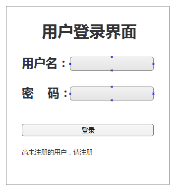
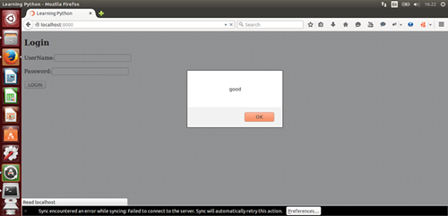
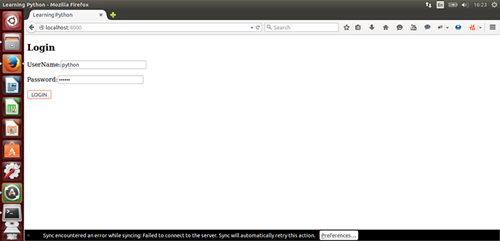

>你们不要被那诸般怪异的教训勾引了去。因为人心靠恩得坚固才是好的，并不是靠饮食；那在饮食上专心的，从来没有得着益处。(HEBREWS 13:9)

#用tornado做网站(2)

既然摆好了一个网站的架势，下面就可以向里面填内容。

##连接数据库

要做的网站，有数据库支持，虽然这不是必须的，但是如果做一个功能强悍的网站，数据库就是必须的了。

接下来的网站，我暂且采用mysql数据库。

怎么连接mysql数据呢？其方法跟[《mysql数据库(1)》](./230.md)中的方法完全一致。为了简单，我也不新建数据库了，就利用已经有的那个数据库。

在上一节中已经建立的文件夹methods中建立一个文件db.py，并且参考[《mysql数据库(1)》](./230.md)和[《mysql数据库(2)》](./231.md)的内容，分别建立起连接对象和游标对象。代码如下：

    #!/usr/bin/env python
    # coding=utf-8

    import MySQLdb

    conn = MySQLdb.connect(host="localhost", user="root", passwd="123123", db="qiwsirtest", port=3306, charset="utf8")    #连接对象

    cur = conn.cursor()    #游标对象

##用户登录

###前端

很多网站上都看到用户登录功能，这里做一个简单的登录，其功能描述为：

>当用户输入网址，呈现在眼前的是一个登录界面。在用户名和密码两个输入框中分别输入了正确的用户名和密码之后，点击确定按钮，登录网站，显示对该用户的欢迎信息。

用图示来说明，首先呈现下图：

用户点击“登录”按钮，经过验证是合法用户之后，就呈现这样的界面：

先用HTML写好第一个界面。进入到templates文件，建立名为index.html的文件：

    <!DOCTYPE html>
    <head>
        <meta charset="UTF-8">
        <meta name="viewport" content="width=device-width, initial-scale=1" />
        <title>Learning Python</title>
    </head>
    <body>
        <h2>Login</h2>
        <form method="POST">
            
UserName:<input type="text" id="username"/>

            
Password:<input type="password" id="password" />

            
<input type="BUTTON" value="LOGIN" id="login" />

        </form>
    </body>

这是一个很简单前端界面。要特别关注`<meta name="viewport" content="width=device-width, initial-scale=1" />`，其目的在将网页的默认宽度(viewport)设置为设备的屏幕宽度(width=device-width)，并且原始缩放比例为1.0(initial-scale=1)，即网页初始大小占屏幕面积的100%。这样做的目的，是让在电脑、手机等不同大小的屏幕上，都能非常好地显示。

这种样式的网页，就是“自适应页面”。当然，自适应页面绝非是仅仅有这样一行代码就完全解决的。要设计自适应页面，也就是要进行“响应式设计”，还需要对CSS、JS乃至于其它元素如表格、图片等进行设计，或者使用一些响应式设计的框架。这个目前暂不讨论，读者可以网上搜索有关资料阅读。

>一提到要能够在手机上，读者是否想到了HTML5呢，这个被一些人热捧、被另一些人蔑视的家伙，毋庸置疑，现在已经得到了越来越广泛的应用。

>HTML5是HTML最新的修订版本，2014年10月由万维网联盟（W3C）完成标准制定。目标是取代1999年所制定的HTML 4.01和XHTML 1.0标准，以期能在互联网应用迅速发展的时候，使网络标准达到符合当代的网络需求。广义论及HTML5时，实际指的是包括HTML、CSS和JavaScript在内的一套技术组合。

>响应式网页设计（英语：Responsive web design，通常缩写为RWD），又称为自适应网页设计、回应式网页设计。 是一种网页设计的技术做法，该设计可使网站在多种浏览设备（从桌面电脑显示器到移动电话或其他移动产品设备）上阅读和导航，同时减少缩放、平移和滚动。

如果要看效果，可以直接用浏览器打开网页，因为它是.html格式的文件。

###引入jQuery

虽然完成了视觉上的设计，但是，如果点击那个login按钮，没有任何反应。因为它还仅仅是一个孤立的页面，这时候需要一个前端交互利器——javascript。

>对于javascript，不少人对它有误解，总认为它是从java演化出来的。的确，两个有相像的地方。但javascript和java的关系，就如同“雷峰塔”和“雷锋”的关系一样。详细读一读来自维基百科的诠释。

>JavaScript，一种直译式脚本语言，是一种动态类型、弱类型、基于原型的语言，内置支持类。它的解释器被称为JavaScript引擎，为浏览器的一部分，广泛用于客户端的脚本语言，最早是在HTML网页上使用，用来给HTML网页增加动态功能。然而现在JavaScript也可被用于网络服务器，如Node.js。

>在1995年时，由网景公司的布兰登·艾克，在网景导航者浏览器上首次设计实现而成。因为网景公司与昇阳公司合作，网景公司管理层希望它外观看起来像Java，因此取名为JavaScript。但实际上它的语义与Self及Scheme较为接近。

>为了获取技术优势，微软推出了JScript，与JavaScript同样可在浏览器上运行。为了统一规格，1997年，在ECMA（欧洲计算机制造商协会）的协调下，由网景、昇阳、微软和Borland公司组成的工作组确定统一标准：ECMA-262。因为JavaScript兼容于ECMA标准，因此也称为ECMAScript。

但是，我更喜欢用jQuery，因为它的确让我省了不少事。

>jQuery是一套跨浏览器的JavaScript库，简化HTML与JavaScript之间的操作。由约翰·雷西格（John Resig）在2006年1月的BarCamp NYC上发布第一个版本。目前是由Dave Methvin领导的开发团队进行开发。全球前10,000个访问最高的网站中，有65%使用了jQuery，是目前最受欢迎的JavaScript库。

在index.html文件中引入jQuery的方法有多种。

原则上将，可以在HTML文件的任何地方引入jQuery库，但是通常放置的地方在html文件的开头`<head>...</head>`中，或者在文件的末尾`</body>`以内。放在开头，如果所用的库比较大、比较多，在载入页面时时间相对长点。

第一种引入方法，是国际化的一种：

    
    
这是直接从jQuery CDN(Content Delivery Network)上直接引用，好处在于如果这个库更新，你不用任何操作，就直接使用最新的了。但是，如果在你的网页中这么用了，如果在某个有很多自信的国家上网，并且没有梯子，会发现网页几乎打不开，就是因为连接上面那个地址的通道是被墙了。

当然，jQuery CDN不止一个，比如官方网站的：

    

第二种引入方法，就是将jQuery下载下来，放在指定地方（比如，与自己网站在同一个存储器中，或者自己可以访问的另外服务器）。到官方网站（[https://jqueryui.com/](https://jqueryui.com/)）下载最新的库，然后将它放在已经建立的statics目录内，为了更清楚区分，可以在里面建立一个子目录js，jquery库放在js子目录里面。下载的时候，建议下载以min.js结尾的文件，因为这个是经过压缩之后，体积小。

我在`statics/js`目录中放置了下载的库，并且为了简短，更名为jquery.min.js。

本来可以用下面的方法引入：

    
    
如果这样写，也是可以的。但是，考虑到tornado的特点，用下面方法引入，更具有灵活性：

    
    
不仅要引入jquery，还需要引入自己写的js指令，所以要建立一个文件，我命名为script.js，也同时引用过来。虽然目前这个文件还是空的。

    

这里用的static_url是一个函数，它是tornado模板提供的一个函数。用这个函数，能够制定静态文件。之所以用它，而不是用上面的那种直接调用的方法，主要原因是如果某一天，将静态文件目录statics修改了，也就是不指定statics为静态文件目录了，定义别的目录为静态文件目录。只需要在定义静态文件目录那里修改（定义静态文件目录的方法请参看上一节），而其它地方的代码不需要修改。

###编写js

先写一个测试性质的东西。

用编辑器打开statics/js/script.js文件，如果没有就新建。输入的代码如下：

    $(document).ready(function(){
        alert("good");
        $("#login").click(function(){
            var user = $("#username").val();
            var pwd = $("#password").val();
            alert("username: "+user);
        });
    });

由于本教程不是专门讲授javascript或者jquery，所以，在js代码部分，只能一带而过，不详细解释。

上面的代码主要实现获取表单中id值分别为username和password所输入的值，alert函数的功能是把值以弹出菜单的方式显示出来。

##hanlers里面的程序

是否还记得在上一节中，在url.py文件中，做了这样的设置：

    from handlers.index import IndexHandler    #假设已经有了

    url = [
        (r'/', IndexHandler),
    ]
    
现在就去把假设有了的那个文件建立起来，即在handlers里面建立index.py文件，并写入如下代码：

    #!/usr/bin/env python
    # coding=utf-8

    import tornado.web

    class IndexHandler(tornado.web.RequestHandler):
        def get(self):
            self.render("index.html")

当访问根目录的时候（不论输入`localhost:8000`，还是`http://127.0.0.1:8000`，或者网站域名），就将相应的请求交给了handlers目录中的index.py文件中的IndexHandler类的get()方法来处理，它的处理结果是呈现index.html模板内容。

`render()`函数的功能在于向请求者反馈网页模板，并且可以向模板中传递数值。关于传递数值的内容，在后面介绍。

上面的文件保存之后，回到handlers目录中。因为这里面的文件要在别处被当做模块引用，所以，需要在这里建立一个空文件，命名为`__init__.py`。这个文件非常重要。在[编写模块](./219.md)一节中，介绍了引用模块的方法。但是，那些方法有一个弊端，就是如果某个目录中有多个文件，就显得麻烦了。其实python已经想到这点了，于是就提供了`__init__.py`文件，只要在该目录中加入了这个文件，该目录中的其它.py文件就可以作为模块被python引入了。

至此，一个带有表单的tornado网站就建立起来了。读者可以回到上一级目录中，找到server.py文件，运行它：

    $ python server.py
    Development server is running at http://127.0.0.1:8000
    Quit the server with Control-C

如果读者在前面的学习中，跟我的操作完全一致，就会在shell中看到上面的结果。

打开浏览器，输入`http://localhost:8000`或者`http://127.0.0.1:8000`，看到的应该是：

这就是script.js中的开始起作用了，第一句是要弹出一个对话框。点击“确定”按钮之后，就是：

在这个页面输入用户名和密码，然后点击Login按钮，就是：

一个网站有了雏形。不过，当提交表单的反应，还仅仅停留在客户端，还没有向后端传递客户端的数据信息。请继续学习下一节。

------

[总目录](./index.md)&nbsp;&nbsp;&nbsp;|&nbsp;&nbsp;&nbsp;[上节：用tornado做网站(1)](./303.md)&nbsp;&nbsp;&nbsp;|&nbsp;&nbsp;&nbsp;[下节：用tornado做网站(3)](./305.md)

如果你认为有必要打赏我，请通过支付宝：**qiwsir@126.com**,不胜感激。