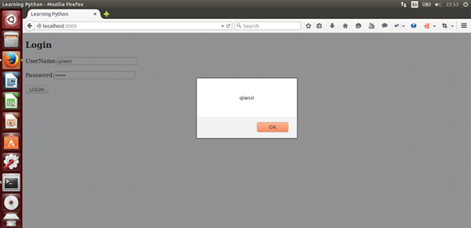

>你们要依从那些引导你们的，且要顺服，因为他们为你们的灵魂时刻警醒，好像那将来交账的人。你们要使他们交的时候有快乐，不至忧愁，若忧愁就与你们无益了。(HEBREWS 13:17)

#用tornado做网站(3)

##数据传输

在已经建立了前端表单之后，就要实现前端和后端之间的数据传递。在工程中，常用到一个被称之为ajax()的方法。

关于ajax的故事，需要浓墨重彩，因为它足够精彩。

ajax是“Asynchronous Javascript and XML”（异步JavaScript和XML）的缩写，在它的发展历程中，汇集了众家贡献。比如微软的IE团队曾经将XHR(XML HttpRequest)用于web浏览器和web服务器间传输数据，并且被W3C标准采用。当然，也有其它公司为Ajax技术做出了贡献，虽然它们都被遗忘了，比如Oddpost，后来被Yahoo!收购并成为Yahoo! Mail的基础。但是，真正让Ajax大放异彩的google是不能被忽视的，正是google在Gmail、Suggest和Maps上大规模使用了Ajax，才使得人们看到了它的魅力，程序员由此而兴奋。

技术总是在不断进化的，进化的方向就是用着越来越方便。

回到上一节使用的jQuery，里面就有ajax()方法，能够让程序员方便的调用。

>ajax()方法通过 HTTP 请求加载远程数据。

>该方法是jQuery底层AJAX实现。简单易用的高层实现见$.get, $.post等。$.ajax() 返回其创建的 XMLHttpRequest 对象。大多数情况下你无需直接操作该函数，除非你需要操作不常用的选项，以获得更多的灵活性。

>最简单的情况下，$.ajax() 可以不带任何参数直接使用。

在上文介绍Ajax的时候，用到了一个重要的术语——“异步”，与之相对应的叫做“同步”。我引用来自[阮一峰的网络日志](http://www.ruanyifeng.com/blog/2012/12/asynchronous%EF%BC%BFjavascript.html)中的通俗描述：

>"同步模式"就是上一段的模式，后一个任务等待前一个任务结束，然后再执行，程序的执行顺序与任务的排列顺序是一致的、同步的；"异步模式"则完全不同，每一个任务有一个或多个回调函数（callback），前一个任务结束后，不是执行后一个任务，而是执行回调函数，后一个任务则是不等前一个任务结束就执行，所以程序的执行顺序与任务的排列顺序是不一致的、异步的。

>"异步模式"非常重要。在浏览器端，耗时很长的操作都应该异步执行，避免浏览器失去响应，最好的例子就是Ajax操作。在服务器端，"异步模式"甚至是唯一的模式，因为执行环境是单线程的，如果允许同步执行所有http请求，服务器性能会急剧下降，很快就会失去响应。

看来，ajax()是前后端进行数据传输的重要角色。

承接上一节的内容，要是用ajax()方法，需要修改script.js文件内容即可：

    $(document).ready(function(){
        $("#login").click(function(){
            var user = $("#username").val();
            var pwd = $("#password").val();
            var pd = {"username":user, "password":pwd};
            $.ajax({
                type:"post",
                url:"/",
                data:pd,
                cache:false,
                success:function(data){
                    alert(data);
                },
                error:function(){
                    alert("error!");
                },
            });
        });
    });
    
在这段代码中，`var pd = {"username":user, "password":pwd};`意即将得到的user和pwd值，放到一个json对象中（关于json，请阅读[《标准库(8)》](./227.md)），形成了一个json对象。接下来就是利用ajax()方法将这个json对象传给后端。

jQuery中的ajax()方法使用比较简单，正如上面代码所示，只需要`$.ajax()`即可，不过需要对立面的参数进行说明。

- type：post还是get。关于post和get的区别，可以阅读：[HTTP POST GET 本质区别详解](https://github.com/qiwsir/ITArticles/blob/master/Tornado/DifferenceHttpGetPost.md)
- url：post或者get的地址
- data：传输的数据，包括三种：（1）html拼接的字符串；（2）json数据；（3）form表单经serialize()序列化的。本例中传输的就是json数据，这也是经常用到的一种方式。
- cache：默认为true，如果不允许缓存，设置为false.
- success：请求成功时执行回调函数。本例中，将返回的data用alert方式弹出来。读者是否注意到，我在很多地方都用了alert()这个东西，目的在于调试，走一步看一步，看看得到的数据是否如自己所要。也是有点不自信呀。
- error：如果请求失败所执行的函数。

##后端接受数据

前端通过ajax技术，将数据已json格式传给了后端，并且指明了对象目录`"/"`，这个目录在url.py文件中已经做了配置，是由handlers目录的index.py文件的IndexHandler类来出来。因为是用post方法传的数据，那么在这个类中就要有post方法来接收数据。所以，要在IndexHandler类中增加post()，增加之后的完善代码是：

    #!/usr/bin/env python
    # coding=utf-8

    import tornado.web

    class IndexHandler(tornado.web.RequestHandler):
        def get(self):
            self.render("index.html")

        def post(self):
            username = self.get_argument("username")
            password = self.get_argument("password")
            self.write(username)

在post()方法中，使用get_argument()函数来接收前端传过来的数据，这个函数的完整格式是`get_argument(name, default=[], strip=True)`，它能够获取name的值。在上面的代码中，name就是从前端传到后端的那个json对象的键的名字，是哪个键就获取该键的值。如果获取不到name的值，就返回default的值，但是这个值默认是没有的，如果真的没有就会抛出HTTP 400。特别注意，在get的时候，通过get_argument()函数获得url的参数，如果是多个参数，就获取最后一个的值。要想获取多个值，可以使用`get_arguments(name, strip=true)`。

上例中分别用get_argument()方法得到了username和password，并且它们都是unicode编码的数据。

tornado.web.RequestHandler的方法write()，即上例中的`self.write(username)`，是后端向前端返回数据。这里返回的实际上是一个字符串，也可返回json字符串。

如果读者要查看修改代码之后的网站效果，最有效的方式先停止网站（ctrl+c），在从新执行`python server.py`运行网站，然后刷新浏览器即可。这是一种较为笨拙的方法。一种灵巧的方法是开启调试模式。是否还记得？在设置setting的时候，写上`debug = True`就表示是调试模式了（参阅：[用tornado做网站(1)](./303.md)）。但是，调试模式也不是十全十美，如果修改模板，就不会加载，还需要重启服务。反正重启也不麻烦，无妨啦。

看看上面的代码效果：

这是前端输入了用户名和密码之后，点击login按钮，提交给后端，后端再向前端返回数据之后的效果。就是我们想要的结果。

##验证用户名和密码

按照流程，用户在前端输入了用户名和密码，并通过ajax提交到了后端，后端借助于get_argument()方法得到了所提交的数据（用户名和密码）。下面要做的事情就是验证这个用户名和密码是否合法，其体现在：

- 数据库中是否有这个用户
- 密码和用户先前设定的密码（已经保存在数据库中）是否匹配

这个验证工作完成之后，才能允许用户登录，登录之后才能继续做某些事情。

首先，在methods目录中（已经有了一个db.py）创建一个文件，我命名为readdb.py，专门用来存储读数据用的函数（这种划分完全是为了明确和演示一些应用方法，读者也可以都写到db.py中）。这个文件的代码如下：

    #!/usr/bin/env python
    # coding=utf-8

    from db import *

    def select_table(table, column, condition, value ):
        sql = "select " + column + " from " + table + " where " + condition + "='" + value + "'"
        cur.execute(sql)
        lines = cur.fetchall()
        return lines

上面这段代码，建议读者可以写上注释，以检验自己是否能够将以往的知识融会贯通地应用。恕我不再解释。

有了这段代码之后，就进一步改写index.py中的post()方法。为了明了，将index.py的全部代码呈现如下：

    #!/usr/bin/env python
    # coding=utf-8

    import tornado.web
    import methods.readdb as mrd

    class IndexHandler(tornado.web.RequestHandler):
        def get(self):
            self.render("index.html")

        def post(self):
            username = self.get_argument("username")
            password = self.get_argument("password")
            user_infos = mrd.select_table(table="users",column="*",condition="username",value=username)
            if user_infos:
                db_pwd = user_infos[0][2]
                if db_pwd == password:
                    self.write("welcome you: " + username)
                else:
                    self.write("your password was not right.")
            else:
                self.write("There is no thi user.")

特别注意，在methods目录中，不要缺少了`__init__.py`文件，才能在index.py中实现`import methods.readdb as mrd`。

代码修改到这里，看到的结果是：

这是正确输入用户名（所谓正确，就是输入的用户名和密码合法，即在数据库中有该用户名，且密码匹配），并提交数据后，反馈给前端的欢迎信息。

如果输入的密码错误了，则如此提示。

这是随意输入的结果，数据库中无此用户。

需要特别说明一点，上述演示中，数据库中的用户密码并没有加密。关于密码加密问题，后续要研究。

------

[总目录](./index.md)&nbsp;&nbsp;&nbsp;|&nbsp;&nbsp;&nbsp;[上节：用tornado做网站(2)](./304.md)&nbsp;&nbsp;&nbsp;|&nbsp;&nbsp;&nbsp;[下节：用tornado做网站(4)](./306.md)

如果你认为有必要打赏我，请通过支付宝：**qiwsir@126.com**,不胜感激。