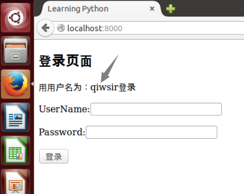
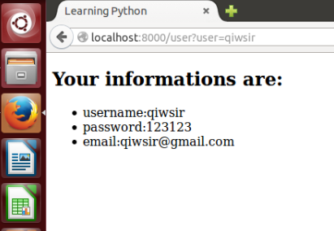
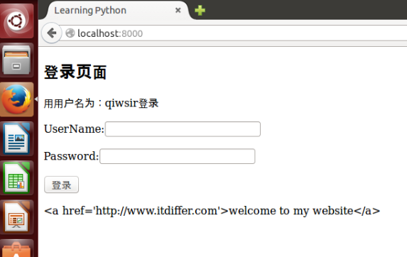
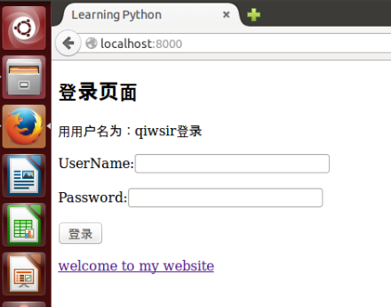

>我的弟兄们，你们落在百般试炼中，都要以为大喜乐；因为你们的信心经过试验，就生忍耐。但忍耐也当成功，使你们成全完备，毫无缺欠。你们中间若有缺少智慧的，应当求那厚赐与众人、也不斥责人的神，主就必赐给他。(JAMES 1:2-5)

#用tornado做网站(4)

##模板

已经基本了解前端向和后端如何传递数据，以及后端如何接收数据的过程和方法之后。我突然发现，前端页面写的太难看了。俗话说“外行看热闹，内行看门道”。程序员写的网站，在更多时候是给“外行”看的，他们可没有耐心来看代码，他们看的就是界面，因此界面是否做的漂亮一点点，是直观重要的。

其实，也不仅仅是漂亮的原因，因为前端页面，还要显示从后端读取出来的数据呢。

恰好，tornado提供比较好用的前端模板(tornado.template)。通过这个模板，能够让前端编写更方便。

###render()

render()方法能够告诉tornado读入哪个模板，插入其中的模板代码，并返回结果给浏览器。比如在IndexHandler类中get()方法里面的`self.render("index.html")`，就是让tornado到templates目中找到名为index.html的文件，读出它的内容，返回给浏览器。这样用户就能看到index.html所规定的页面了。当然，在前面所写的index.html还仅仅是html标记，没有显示出所谓“模板”的作用。为此，将index.html和index.py文件做如下改造。

    #!/usr/bin/env python
    # coding=utf-8

    import tornado.web
    import methods.readdb as mrd

    class IndexHandler(tornado.web.RequestHandler):
        def get(self):
            usernames = mrd.select_columns(table="users",column="username")
            one_user = usernames[0][0]
            self.render("index.html", user=one_user)

index.py文件中，只修改了get()方法，从数据库中读取用户名，并且提出一个用户（one_user），然后通过`self.render("index.html", user=one_user)`将这个用户名放到index.html中，其中`user=one_user`的作用就是传递对象到模板。

提醒读者注意的是，在上面的代码中，我使用了`mrd.select_columns(table="users",column="username")`，也就是说必须要在methods目录中的readdb.py文件中有一个名为select_columns的函数。为了使读者能够理解，贴出已经修改之后的readdb.py文件代码，比上一节多了函数select_columns：

    #!/usr/bin/env python
    # coding=utf-8

    from db import *

    def select_table(table, column, condition, value ):
        sql = "select " + column + " from " + table + " where " + condition + "='" + value + "'"
        cur.execute(sql)
        lines = cur.fetchall()
        return lines

    def select_columns(table, column ):
        sql = "select " + column + " from " + table
        cur.execute(sql)
        lines = cur.fetchall()
        return lines

下面是index.html修改后的代码：

    <!DOCTYPE html>
    <head>
        <meta charset="UTF-8">
        <meta name="viewport" content="width=device-width, initial-scale=1" />
        <title>Learning Python</title>
    </head>
    <body>
        <h2>登录页面</h2>
        
用用户名为：{{user}}登录

        <form method="POST">
            
UserName:<input type="text" id="username"/>

            
Password:<input type="password" id="password" />

            
<input type="BUTTON" value="登录" id="login" />

        </form>
        
        
    </body>

`
用用户名为：{{user}}登录
`，这里用了`{{ }}`方式，接受对应的变量引导来的对象。也就是在首页打开之后，用户应当看到有一行提示。如下图一样。

图中箭头是我为了强调后来加上去的，箭头所指的，就是从数据库中读取出来的用户名，借助于模板中的双大括号`{{ }}`显示出来。

`{{ }}`本质上是占位符。当这个html被执行的时候，这个位置会被一个具体的对象（例如上面就是字符串qiwsir）所替代。具体是哪个具体对象替代这个占位符，完全是由render()方法中关键词来指定，也就是render()中的关键词与模板中的占位符包裹着的关键词一致。

用这种方式，修改一下用户正确登录之后的效果。要求用户正确登录之后，跳转到另外一个页面，并且在那个页面中显示出用户的完整信息。

先修改url.py文件，在其中增加一些内容。完整代码如下：

    #!/usr/bin/env python
    # coding=utf-8
    """
    the url structure of website
    """
    import sys
    reload(sys)
    sys.setdefaultencoding("utf-8")

    from handlers.index import IndexHandler
    from handlers.user import UserHandler

    url = [
        (r'/', IndexHandler),
        (r'/user', UserHandler),
    ]

然后就建立handlers/user.py文件，内容如下：

    #!/usr/bin/env python
    # coding=utf-8

    import tornado.web
    import methods.readdb as mrd

    class UserHandler(tornado.web.RequestHandler):
        def get(self):
            username = self.get_argument("user")
            user_infos = mrd.select_table(table="users",column="*",condition="username",value=username)
            self.render("user.html", users = user_infos)

在get()中使用`self.get_argument("user")`，目的是要通过url获取参数user的值。因此，当用户登录后，得到正确返回值，那么js应该用这样的方式载入新的页面。

注意：上述的user.py代码为了简单突出本将要说明的，没有对user_infos的结果进行判断。在实际的编程中，这要进行判断或者使用try...except。

    $(document).ready(function(){
        $("#login").click(function(){
            var user = $("#username").val();
            var pwd = $("#password").val();
            var pd = {"username":user, "password":pwd};
            $.ajax({
                type:"post",
                url:"/",
                data:pd,
                cache:false,
                success:function(data){
                    window.location.href = "/user?user="+data;
                },
                error:function(){
                    alert("error!");
                },
            });
        });
    });
            
接下来是user.html模板。注意上面的代码中，user_infos引用的对象不是一个字符串了，也就是传入模板的不是一个字符串，是一个元组。对此，模板这样来处理它。

    <!DOCTYPE html>
    <head>
        <meta charset="UTF-8">
        <meta name="viewport" content="width=device-width, initial-scale=1" />
        <title>Learning Python</title>
    </head>
    <body>
        <h2>Your informations are:</h2>
        <ul>
            
                <li>username:{{one[1]}}</li>
                <li>password:{{one[2]}}</li>
                <li>email:{{one[3]}}</li>
            
        </ul>
    </body>

显示的效果是：

在上面的模板中，其实用到了模板语法。

###模板语法

在模板的双大括号中，可以写类似python的语句或者表达式。比如：

    >>> from tornado.template import Template
    >>> print Template("{{ 3+4 }}").generate()
    7
    >>> print Template("{{ 'python'[0:2] }}").generate()
    py
    >>> print Template("{{ '-'.join(str(i) for i in range(10)) }}").generate()
    0-1-2-3-4-5-6-7-8-9

意即如果在模板中，某个地方写上`{{ 3+4 }}`，当那个模板被render()读入之后，在页面上该占位符的地方就显示`7`。这说明tornado自动将双大括号内的表达式进行计算，并将其结果以字符串的形式返回到浏览器输出。

除了表达式之外，python的语句也可以在表达式中使用，包括if、for、while和try。只不过要有一个语句开始和结束的标记，用以区分那里是语句、哪里是HTML标记符。

语句的形式：`{}`

例如：

    {}
        {{ user }}
    {}

上面的举例中，第一行虽然是if语句，但是不要在后面写冒号了。最后一行一定不能缺少，表示语句块结束。将这一个语句块放到模板中，当被render读取此模板的时候，tornado将执行结果返回给浏览器显示，跟前面的表达式一样。实际的例子可以看上图输出结果和对应的循环语句。

##转义字符

虽然读者现在已经对字符转义问题不陌生了，但是在网站开发中，它还将是一个令人感到麻烦的问题。所谓转义字符（Escape Sequence）也称字符实体(Character Entity)，它的存在是因为在网页中`<, >`之类的符号，是不能直接被输出的，因为它们已经被用作了HTML标记符了，如果在网页上用到它们，就要转义。另外，也有一些字符在ASCII字符集中没有定义（如版权符号“©”），这样的符号要在HTML中出现，也需要转义字符（如“©”对应的转义字符是“＆copy;”）。

上述是指前端页面的字符转义，其实不仅前端，在后端程序中，因为要读写数据库，也会遇到字符转义问题。

比如一个简单的查询语句：`select username, password from usertable where username='qiwsir'`，如果在登录框中没有输入qiwsir，而是输入了`a;drop database;`，这个查询语句就变成了`select username, password from usertable where username=a; drop database;`，如果后端程序执行了这条语句会怎么样呢？后果很严重，因为会`drop database`，届时真的是欲哭无泪了。类似的情况还很多，比如还可以输入`<input type="text" />`，结果出现了一个输入框，如果是`<form action="..."`，会造成跨站攻击了。这方面的问题还不少呢，读者有空可以到网上搜一下所谓sql注入问题，能了解更多。

所以，后端也要转义。

转义是不是很麻烦呢？

Tornado为你着想了，因为存在以上转义问题，而且会有粗心的程序员忘记了，于是Tornado中，模板默认为自动转义。这是多么好的设计呀。于是所有表单输入的，你就不用担心会遇到上述问题了。

为了能够体会自动转义，不妨在登录框中输入上面那样字符，然后可以用print语句看一看，后台得到了什么。

>print语句，在python3中是print()函数，在进行程序调试的时候非常有用。经常用它把要看个究竟的东西打印出来。

自动转义是一个好事情，但是，有时候会不需要转义，比如想在模板中这样做：

    <!DOCTYPE html>
    <head>
        <meta charset="UTF-8">
        <meta name="viewport" content="width=device-width, initial-scale=1" />
        <title>Learning Python</title>
    </head>
    <body>
        <h2>登录页面</h2>
        
用用户名为：{{user}}登录

        <form method="POST">
            
UserName:<input type="text" id="username"/>

            
Password:<input type="password" id="password" />

            
<input type="BUTTON" value="登录" id="login" />

        </form>
        
        {{ website }}
        
        
    </body>

这是index.html的代码，我增加了``，作用是设置一个变量，名字是website，它对应的内容是一个做了超链接的文字。然后在下面使用这个变量`{{ website }}`，本希望能够出现的是有一行字“welcome to my website”，点击这行字，就可以打开对应链接的网站。可是，看到了这个：

下面那一行，把整个源码都显示出来了。这就是因为自动转义的结果。这里需要的是不转义。于是可以将`{{ website }}`修改为：

    
    
表示这一行不转义。但是别的地方还是转义的。这是一种最推荐的方法。

如果你要全不转义，可以使用：

    
    {{ website }}
    
貌似省事，但是我不推荐。

##几个备查函数

下面几个函数，放在这里备查，或许在某些时候用到。都是可以使用在模板中的。

- escape(s)：替换字符串s中的&、<、>为他们对应的HTML字符。
- url_escape(s)：使用urllib.quote_plus替换字符串s中的字符为URL编码形式。
- json_encode(val)：将val编码成JSON格式。
- squeeze(s)：过滤字符串s，把连续的多个空白字符替换成一个空格。

此外，在模板中也可以使用自己编写的函数。但不常用。所以本教程就不啰嗦这个了。

------

[总目录](./index.md)&nbsp;&nbsp;&nbsp;|&nbsp;&nbsp;&nbsp;[上节：用tornado做网站(3)](./305.md)&nbsp;&nbsp;&nbsp;|&nbsp;&nbsp;&nbsp;[下节：用tornado做网站(5)](./307.md)

如果你认为有必要打赏我，请通过支付宝：**qiwsir@126.com**,不胜感激。
