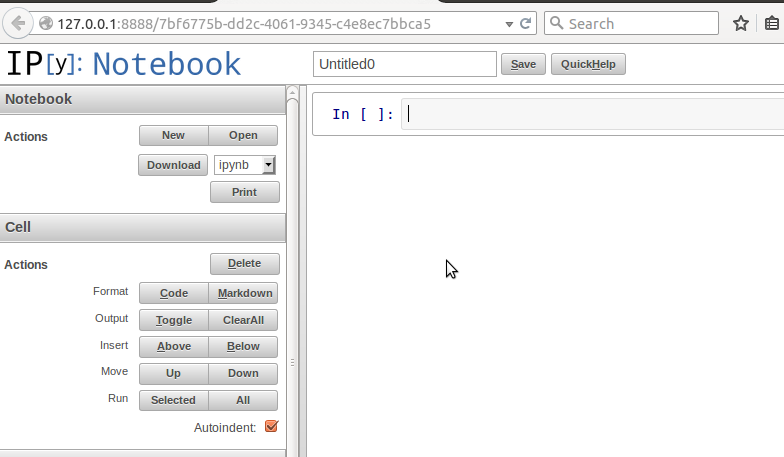
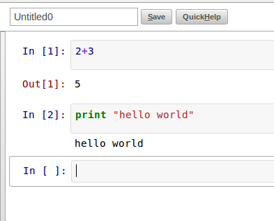
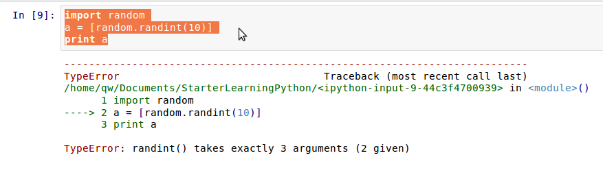
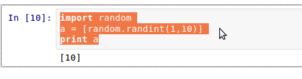
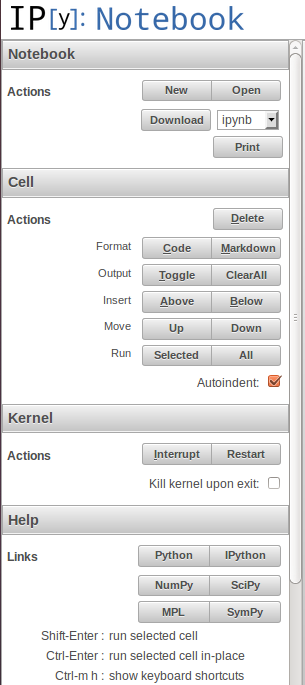

>你们贪恋，还是得不着；你们杀害嫉妒，又斗殴争战，也不能得。你们得不着，是因为你们不求。你们求也得不着，是因为你们妄求，要浪费在你们得宴乐中。你们这些淫乱的人哪，岂不知与世俗为友就是与神为敌吗？所以凡想要与世俗为友的，就是与神为敌了。(JAMES 4:2-4)

#为计算做准备

##闲谈

计算机姑娘是擅长进行科学计算的，本来她就是做这个的，只不过后来人们让她处理了很多文字内容罢了，乃至于现在有一些人认为她是用来打字写文章的（变成打字机了），忘记了她最擅长的计算。

每种编程语言都能用来做计算，区别在于编程过程中，是否有足够的工具包供给。比如用汇编，就得自己多劳动，如果用Fortran，就方便得多了。不知道读者是否听说过Fortran，貌似古老，现在仍被使用。（以下引文均来自维基百科）

>Fortran语言是為了滿足数值计算的需求而發展出來的。1953年12月，IBM公司工程師約翰·巴科斯（J. Backus）因深深體會編寫程序很困難，而寫了一份備忘錄給董事長斯伯特·赫德（Cuthbert Hurd），建議為IBM704系統設計全新的電腦語言以提升開發效率。當時IBM公司的顾问冯·诺伊曼强烈反对，因為他認為不切實際而且根本不必要。但赫德批准了這項計劃。1957年，IBM公司开发出第一套FORTRAN语言，在IBM704電腦上運作。歷史上第一支FORTRAN程式在馬里蘭州的西屋貝地斯核電廠試驗。1957年4月20日星期五的下午，一位IBM軟體工程師決定在電廠內編譯第一支FORTRAN程式，當程式碼輸入後，經過編譯，印表機列出一行訊息：“原始程式錯誤……右側括號後面沒有逗號”，這讓現場人員都感到訝異，修正這個錯誤後，印表機輸出了正確結果。而西屋電氣公司因此意外地成為FORTRAN的第一個商業用戶。1958年推出FORTRAN Ⅱ，幾年後又推出FORTRAN Ⅲ，1962年推出FORTRAN Ⅳ後，開始廣泛被使用。目前最新版是Fortran 2008。

还有一个广为应用的不得不说，那就是matlab，一直以来被人称赞。

>MATLAB（矩阵实验室）是MATrix LABoratory的缩写，是一款由美国The MathWorks公司出品的商业数学软件。MATLAB是一种用于算法开发、数据可视化、数据分析以及数值计算的高级技术计算语言和交互式环境。除了矩阵运算、绘制函数/数据图像等常用功能外，MATLAB还可以用来创建用户界面及与调用其它语言（包括C,C++,Java,Python和FORTRAN）编写的程序。

但是，它是收费的商业软件，虽然在某国这个无所谓。

还有R语言，也是在计算领域被多多使用的。

>R语言，一種自由軟體程式語言與操作環境，主要用于统计分析、绘图、数据挖掘。R本來是由來自新西蘭奧克蘭大學的Ross Ihaka和Robert Gentleman開發（也因此稱為R），現在由“R開發核心團隊”負責開發。R是基于S语言的一个GNU計劃项目，所以也可以当作S语言的一种实现，通常用S语言编写的代码都可以不作修改的在R环境下运行。R的語法是來自Scheme。

最后要说的就是python，近几年使用python的领域不断扩张，包括在科学计算领域，它已经成为了一种趋势。在这个过程中，虽然有不少人诟病python的这个慢那个解释动态语言之类（这种说法是值得讨论的），但是，依然无法阻挡python在科学计算领域大行其道。之所以这样，就是因为它是python。

- 开源，就这一条就已经足够了，一定要用开源的东西。至于为什么，本教程前面都阐述过了。
- 因为开源，所以有非常棒的社区，里面有相当多支持科学计算的库，不用还等待何时？
- 简单易学，这点对那些不是专业程序员来讲非常重要。我就接触到一些搞天文学和生物学的研究者，他们正在使用python进行计算。
- 在科学计算上如果用了python，能够让数据跟其它的比如web无缝对接，这不是很好的吗？

当然，最重要一点，就是本教程是讲python的，所以，在科学计算这块肯定不会讲Fortran或者R，一定得是python。

##安装

如果读者使用Ubuntu或者Debian，可以这样来安装：

    sudo apt-get install python-numpy python-scipy python-matplotlib ipython ipython-notebook python-pandas python-sympy python-nose
    
一股脑把可能用上的都先装上。在安装的时候，如果需要其它的依赖，你会明显看到的。

如果是别的系统，比如windows类，请自己网上查找安装方法吧，这里内容不少，最权威的是看官方网站列出的安装：[http://www.scipy.org/install.html](http://www.scipy.org/install.html)

##基本操作

在科学计算中，业界比较喜欢使用ipython notebook，前面已经安装。在shell中执行

    ipython notebook --pylab=inline
    
得到下图的界面，这是在浏览器中打开的：

在In后面的编辑去，可以写python语句。然后按下`SHIFT+ENTER`或者`CTRL+ENTER` 就能执行了，如果按下`ENTER`，不是执行，是在当前编辑区换行。

Ipython Notebook是一个非常不错的编辑器，执行之后，直接显示出来输入内容和输出的结果。当然，错误是难免的，它会：

注意观察图中的箭头所示，直接标出有问题的行。返回编辑区，修改之后可继续执行。

不要忽视左边的辅助操作，能够让你在使用ipython notebook的时候更方便。

------

[总目录](./index.md)&nbsp;&nbsp;&nbsp;|&nbsp;&nbsp;&nbsp;[上节：用tornado做网站(7)](./309.md)&nbsp;&nbsp;&nbsp;|&nbsp;&nbsp;&nbsp;[下节：Pandas使用(1)](./311.md)

如果你认为有必要打赏我，请通过支付宝：**qiwsir@126.com**,不胜感激。