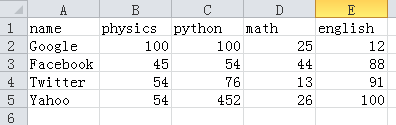

>总而言之，你们都要同心，彼此体恤，相爱如弟兄，存慈怜谦卑的心。不要以恶报恶、以辱骂还辱骂，倒要祝福，因你们是为此蒙召，好叫你们承受福气。因为经上说：“人若爱生命，愿享美福，须要禁止舌头不出恶言，嘴唇不说诡诈的话；也要离恶行善，寻求和睦，一心追赶。因为主的眼看顾义人，主的耳听他们的祷告；惟有行恶的人，主向他们变脸”。(PTETER 3:8-12)

#Pandas使用(2)

特别向读者生命，本教程因为篇幅限制，不能将有关pandas的内容完全详细讲述，只能“抛砖引玉”，向大家做一个简单介绍，说明其基本使用方法。当读者在实践中使用的时候，如果遇到问题，可以结合相关文档或者google来解决。

##读取csv文件

###关于csv文件

csv是一种通用的、相对简单的文件格式，在表格类型的数据中用途很广泛，很多关系型数据库都支持这种类型文件的导入导出，并且excel这种常用的数据表格也能和csv文件之间转换。

>逗号分隔值（Comma-Separated Values，CSV，有时也称为字符分隔值，因为分隔字符也可以不是逗号），其文件以纯文本形式存储表格数据（数字和文本）。纯文本意味着该文件是一个字符序列，不含必须象二进制数字那样被解读的数据。CSV文件由任意数目的记录组成，记录间以某种换行符分隔；每条记录由字段组成，字段间的分隔符是其它字符或字符串，最常见的是逗号或制表符。通常，所有记录都有完全相同的字段序列。

从上述维基百科的叙述中，重点要解读出“字段间分隔符”“最常见的是逗号或制表符”，当然，这种分隔符也可以自行制定。比如下面这个我命名为marks.csv的文件，就是用逗号（必须是半角的）作为分隔符：

    name,physics,python,math,english
    Google,100,100,25,12
    Facebook,45,54,44,88
    Twitter,54,76,13,91
    Yahoo,54,452,26,100

其实，这个文件要表达的事情是（如果转化为表格形式）：

###普通方法读取

最简单、最直接的就是open()打开文件：

    >>> with open("./marks.csv") as f:
    ...     for line in f:
    ...         print line
    ... 
    name,physics,python,math,english

    Google,100,100,25,12

    Facebook,45,54,44,88

    Twitter,54,76,13,91

    Yahoo,54,452,26,100
    
    
此方法可以，但略显麻烦。

python中还有一个csv的标准库，足可见csv文件的使用频繁了。

    >>> import csv 
    >>> dir(csv)
    ['Dialect', 'DictReader', 'DictWriter', 'Error', 'QUOTE_ALL', 'QUOTE_MINIMAL', 'QUOTE_NONE', 'QUOTE_NONNUMERIC', 'Sniffer', 'StringIO', '_Dialect', '__all__', '__builtins__', '__doc__', '__file__', '__name__', '__package__', '__version__', 'excel', 'excel_tab', 'field_size_limit', 'get_dialect', 'list_dialects', 're', 'reader', 'reduce', 'register_dialect', 'unregister_dialect', 'writer']

什么时候也不要忘记这种最佳学习方法。从上面结果可以看出，csv模块提供的属性和方法。仅仅就读取本例子中的文件：

    >>> import csv 
    >>> csv_reader = csv.reader(open("./marks.csv"))
    >>> for row in csv_reader:
    ...     print row
    ... 
    ['name', 'physics', 'python', 'math', 'english']
    ['Google', '100', '100', '25', '12']
    ['Facebook', '45', '54', '44', '88']
    ['Twitter', '54', '76', '13', '91']
    ['Yahoo', '54', '452', '26', '100']

 算是稍有改善。

###用Pandas读取

如果对上面的结果都有点不满意的话，那么看看Pandas的效果：

    >>> import pandas as pd
    >>> marks = pd.read_csv("./marks.csv")
    >>> marks
           name  physics  python  math  english
    0    Google      100     100    25       12
    1  Facebook       45      54    44       88
    2   Twitter       54      76    13       91
    3     Yahoo       54     452    26      100

看了这样的结果，你还不感觉惊讶吗？你还不喜欢上Pandas吗？这是多么精妙的显示。它是什么？它就是一个DataFrame数据。

还有另外一种方法：

    >>> pd.read_table("./marks.csv", sep=",")
           name  physics  python  math  english
    0    Google      100     100    25       12
    1  Facebook       45      54    44       88
    2   Twitter       54      76    13       91
    3     Yahoo       54     452    26      100

如果你有足够的好奇心来研究这个名叫DataFrame的对象，可以这样：

    >>> dir(marks)
    ['T', '_AXIS_ALIASES', '_AXIS_NAMES', '_AXIS_NUMBERS', '__add__', '__and__', '__array__', '__array_wrap__', '__class__', '__contains__', '__delattr__', '__delitem__', '__dict__', '__div__', '__doc__', '__eq__', '__floordiv__', '__format__', '__ge__', '__getattr__', '__getattribute__', '__getitem__', '__getstate__', '__gt__', '__hash__', '__init__', '__iter__', '__le__', '__len__', '__lt__', '__module__', '__mul__', '__ne__', '__neg__', '__new__', '__nonzero__', '__or__', '__pow__', '__radd__', '__rdiv__', '__reduce__', '__reduce_ex__', '__repr__', '__rfloordiv__', '__rmul__', '__rpow__', '__rsub__', '__rtruediv__', '__setattr__', '__setitem__', '__setstate__', '__sizeof__', '__str__', '__sub__', '__subclasshook__', '__truediv__', '__weakref__', '__xor__', '_agg_by_level', '_align_frame', '_align_series', '_apply_broadcast', '_apply_raw', '_apply_standard', '_auto_consolidate', '_bar_plot', '_boolean_set', '_box_item_values', '_clear_item_cache', '_combine_const', '_combine_frame', '_combine_match_columns', '_combine_match_index', '_combine_series', '_combine_series_infer', '_compare_frame', '_consolidate_inplace', '_constructor', '_count_level', '_cov_helper', '_data', '_default_stat_axis', '_expand_axes', '_from_axes', '_get_agg_axis', '_get_axis', '_get_axis_name', '_get_axis_number', '_get_item_cache', '_get_numeric_data', '_getitem_array', '_getitem_multilevel', '_helper_csvexcel', '_het_axis', '_indexed_same', '_init_dict', '_init_mgr', '_init_ndarray', '_is_mixed_type', '_item_cache', '_ix', '_join_compat', '_reduce', '_reindex_axis', '_reindex_columns', '_reindex_index', '_reindex_with_indexers', '_rename_columns_inplace', '_rename_index_inplace', '_sanitize_column', '_series', '_set_axis', '_set_item', '_set_item_multiple', '_shift_indexer', '_slice', '_unpickle_frame_compat', '_unpickle_matrix_compat', '_verbose_info', '_wrap_array', 'abs', 'add', 'add_prefix', 'add_suffix', 'align', 'append', 'apply', 'applymap', 'as_matrix', 'asfreq', 'astype', 'axes', 'boxplot', 'clip', 'clip_lower', 'clip_upper', 'columns', 'combine', 'combineAdd', 'combineMult', 'combine_first', 'consolidate', 'convert_objects', 'copy', 'corr', 'corrwith', 'count', 'cov', 'cummax', 'cummin', 'cumprod', 'cumsum', 'delevel', 'describe', 'diff', 'div', 'dot', 'drop', 'drop_duplicates', 'dropna', 'dtypes', 'duplicated', 'fillna', 'filter', 'first_valid_index', 'from_csv', 'from_dict', 'from_items', 'from_records', 'get', 'get_dtype_counts', 'get_value', 'groupby', 'head', 'hist', 'icol', 'idxmax', 'idxmin', 'iget_value', 'index', 'info', 'insert', 'irow', 'iteritems', 'iterkv', 'iterrows', 'ix', 'join', 'last_valid_index', 'load', 'lookup', 'mad', 'max', 'mean', 'median', 'merge', 'min', 'mul', 'ndim', 'pivot', 'pivot_table', 'plot', 'pop', 'prod', 'product', 'quantile', 'radd', 'rank', 'rdiv', 'reindex', 'reindex_axis', 'reindex_like', 'rename', 'rename_axis', 'reorder_levels', 'reset_index', 'rmul', 'rsub', 'save', 'select', 'set_index', 'set_value', 'shape', 'shift', 'skew', 'sort', 'sort_index', 'sortlevel', 'stack', 'std', 'sub', 'sum', 'swaplevel', 'tail', 'take', 'to_csv', 'to_dict', 'to_excel', 'to_html', 'to_panel', 'to_records', 'to_sparse', 'to_string', 'to_wide', 'transpose', 'truncate', 'unstack', 'values', 'var', 'xs']

一个一个浏览一下，通过名字可以直到那个方法或者属性的大概，然后就可以根据你的喜好和需要，试一试：
    
    >>> marks.index
    Int64Index([0, 1, 2, 3], dtype=int64)
    >>> marks.columns
    Index([name, physics, python, math, english], dtype=object)
    >>> marks['name'][1]
    'Facebook'

这几个是让你回忆一下上一节的。从DataFrame对象的属性和方法中找一个，再尝试：

    >>> marks.sort(column="python")
           name  physics  python  math  english
    1  Facebook       45      54    44       88
    2   Twitter       54      76    13       91
    0    Google      100     100    25       12
    3     Yahoo       54     452    26      100

按照竖列"python"的值排队，结果也是很让人满意的。下面几个操作，也是常用到的，并且秉承了python的一贯方法：

    >>> marks[:1]
         name  physics  python  math  english
    0  Google      100     100    25       12
    >>> marks[1:2]
           name  physics  python  math  english
    1  Facebook       45      54    44       88
    >>> marks["physics"]
    0    100
    1     45
    2     54
    3     54
    Name: physics

##读取其它格式数据

csv是常用来存储数据的格式之一，此外常用的还有MS excel格式的文件，以及json和xml格式的数据等。它们都可以使用pandas来轻易读取。

###.xls或者.xlsx

在下面的结果中寻觅一下，有没有跟excel有关的方法？

    >>> dir(pd)
    ['DataFrame', 'DataMatrix', 'DateOffset', 'DateRange', 'ExcelFile', 'ExcelWriter', 'Factor', 'HDFStore', 'Index', 'Int64Index', 'MultiIndex', 'Panel', 'Series', 'SparseArray', 'SparseDataFrame', 'SparseList', 'SparsePanel', 'SparseSeries', 'SparseTimeSeries', 'TimeSeries', 'WidePanel', '__builtins__', '__doc__', '__docformat__', '__file__', '__name__', '__package__', '__path__', '__version__', '_engines', '_sparse', '_tseries', 'concat', 'core', 'crosstab', 'datetime', 'datetools', 'debug', 'ewma', 'ewmcorr', 'ewmcov', 'ewmstd', 'ewmvar', 'ewmvol', 'fama_macbeth', 'groupby', 'info', 'io', 'isnull', 'lib', 'load', 'merge', 'notnull', 'np', 'ols', 'pivot', 'pivot_table', 'read_clipboard', 'read_csv', 'read_table', 'reset_printoptions', 'rolling_apply', 'rolling_corr', 'rolling_corr_pairwise', 'rolling_count', 'rolling_cov', 'rolling_kurt', 'rolling_max', 'rolling_mean', 'rolling_median', 'rolling_min', 'rolling_quantile', 'rolling_skew', 'rolling_std', 'rolling_sum', 'rolling_var', 'save', 'set_eng_float_format', 'set_printoptions', 'sparse', 'stats', 'tools', 'util', 'value_range', 'version']

虽然没有类似`read_csv()`的方法（在网上查询，有的资料说有`read_xls()`方法，那时老黄历了），但是有`ExcelFile`类，于是乎：

    >>> xls = pd.ExcelFile("./marks.xlsx")
    Traceback (most recent call last):
      File "<stdin>", line 1, in <module>
      File "/usr/lib/pymodules/python2.7/pandas/io/parsers.py", line 575, in __init__
        from openpyxl import load_workbook
    ImportError: No module named openpyxl

我这里少了一个模块，看报错提示，用pip安装openpyxl模块：`sudo pip install openpyxl`。继续：

    >>> xls = pd.ExcelFile("./marks.xlsx")
    >>> dir(xls)
    ['__class__', '__delattr__', '__dict__', '__doc__', '__format__', '__getattribute__', '__hash__', '__init__', '__module__', '__new__', '__reduce__', '__reduce_ex__', '__repr__', '__setattr__', '__sizeof__', '__str__', '__subclasshook__', '__weakref__', '_parse_xls', '_parse_xlsx', 'book', 'parse', 'path', 'sheet_names', 'use_xlsx']
    >>> xls.sheet_names
    ['Sheet1', 'Sheet2', 'Sheet3']
    >>> sheet1 = xls.parse("Sheet1")
    >>> sheet1
       0    1    2   3    4
    0  5  100  100  25   12
    1  6   45   54  44   88
    2  7   54   76  13   91
    3  8   54  452  26  100

结果中，columns的名字与前面csv结果不一样，数据部分是同样结果。从结果中可以看到，sheet1也是一个DataFrame对象。

对于单个的DataFrame对象，如何通过属性和方法进行操作，如果读者理解了本教程从一开始就贯穿进来的思想——利用dir()和help()或者到官方网站，看文档！——此时就能比较轻松地进行各种操作了。下面的举例，纯属是为了增加篇幅和向读者做一些诱惑性广告，或者给懒惰者看看。当然，肯定是不完全，也不能在实践中照搬。基本方法还在刚才交代过的思想。

如果遇到了json或者xml格式的数据怎么办呢？直接使用本教程第贰季第陆章中[《标准库(7)](./226.md)和[《标准库(8)》](./227.md)中的方法，再结合Series或者DataFrame数据特点读取。

此外，还允许从数据库中读取数据，首先就是使用本教程第贰季第柒章中阐述的各种数据库（[《MySQL数据库(1)》](./230.md)，[《MongoDB数据库》](./232.md)，[《SQLite数据库》](./233.md)）连接和读取方法，将相应数据查询出来，并且将结果（结果通常是列表或者元组类型，或者是字符串）按照前面讲述的Series或者DataFrame类型数据进行组织，然后就可以对其操作。

------

[总目录](./index.md)&nbsp;&nbsp;&nbsp;|&nbsp;&nbsp;&nbsp;[上节：Pandas使用(1)](./311.md)&nbsp;&nbsp;&nbsp;|&nbsp;&nbsp;&nbsp;[下节：Pandas使用(3)](./313.md)

如果你认为有必要打赏我，请通过支付宝：**qiwsir@126.com**,不胜感激。
