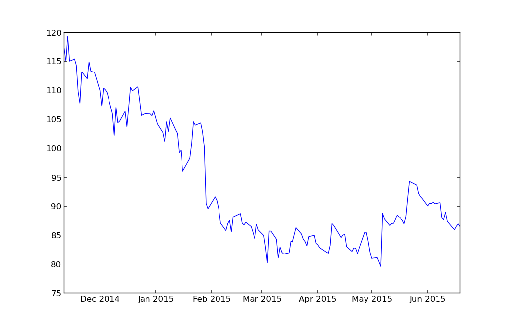

>神阻挡骄傲的人，赐恩给谦卑的人。(1 PETER 5:5)

#处理股票数据

这段时间某国股市很火爆，不少砖家在分析股市火爆的各种原因，更有不少人看到别人挣钱眼红了，点钞票杀入股市。不过，我还是很淡定的，因为没钱，所以不用担心任何股市风险临到。

但是，为了体现本人也是与时俱进的，就以股票数据为例子，来简要说明pandas和其它模块在处理数据上的应用。

##下载yahoo上的数据

或许你稀奇，为什么要下载yahoo上的股票数据呢？国内网站上不是也有吗？是有。但是，那时某国内的。我喜欢yahoo，因为她曾经吸引我，注意我说的是[www.yahoo.com](http://www.yahoo.com)，不是后来被阿里巴巴收购并拆散的那个。

虽然yahoo的世代渐行渐远，但她终究是值得记忆的。所以，我要演示如何下载yahoo财经栏目中的股票数据。

    In [1]: import pandas 
    In [2]: import pandas.io.data
    
    In [3]: sym = "BABA"

    In [4]: finace = pandas.io.data.DataReader(sym, "yahoo", start="2014/11/11")
    In [5]: print finace.tail(3)
                     Open       High        Low      Close    Volume  Adj Close
    Date                                                                       
    2015-06-17  86.580002  87.800003  86.480003  86.800003  10206100  86.800003
    2015-06-18  86.970001  87.589996  86.320000  86.750000  11652600  86.750000
    2015-06-19  86.510002  86.599998  85.169998  85.739998  10207100  85.739998

下载了阿里巴巴的股票数据（自2014年11月11日以来），并且打印最后三条。

##画图

已经得到了一个DataFrame对象，就是前面已经下载并用finace变量引用的对象。

    In[6]: import matplotlib.pyplot as plt
    In [7]: plt.plot(finace.index, finace["Open"])
    Out[]: [<matplotlib.lines.Line2D at 0xa88e5cc>]

    In [8]: plt.show()

于是乎出来了下图：

从图中可以看出阿里巴巴的股票自从2014年11月11日到2015年6月19日的股票开盘价变化。看来那个所谓的“光棍节”得到了股市的认可，所以，在此我郑重地建议阿里巴巴要再造一些节日，比如3月3日、4月4日，还好，某国还有农历，阳历用完了用农历。可以维持股票高开高走了。

阿里巴巴的事情，我就不用操心了。

上面指令中的`import matplotlib.pyplot as plt`是个此前没有看到的。`matplotlib`模块是python中绘制二维图形的模块，是最好的模块。本教程在这里展示了它的一个小小地绘图功能，读者就一下看到阿里巴巴“光棍节”的力量，难道还不能说明matplotlib的强悍吗？很可惜，matplotlib的发明者——John Hunter已经于2012年8月28日因病医治无效英年早逝，这真是天妒英才呀。为了缅怀他，请读者访问官方网站：[matplotlib.org](http://matplotlib.org)，并认真学习这个模块的使用。

经过上面的操作，读者可以用`dir()`这个以前常用的法宝，来查看finace所引用的DataFrame对象的方法和属性等。只要运用此前不断向大家演示的方法——`dir+help`——就能够对这个对象进行操作，也就是能够对该股票数据进行各种操作。

再次声明，本课程仅仅是稍微演示一下相关操作，如果读者要深入研习，恭请寻找相关的专业书籍资料阅读学习。
    
------

[总目录](./index.md)&nbsp;&nbsp;&nbsp;|&nbsp;&nbsp;&nbsp;[上节：Pandas使用(2)](./312.md)&nbsp;&nbsp;&nbsp;|&nbsp;&nbsp;&nbsp;[下节：网络爬虫(1)](./314.md)

如果你认为有必要打赏我，请通过支付宝：**qiwsir@126.com**,不胜感激。