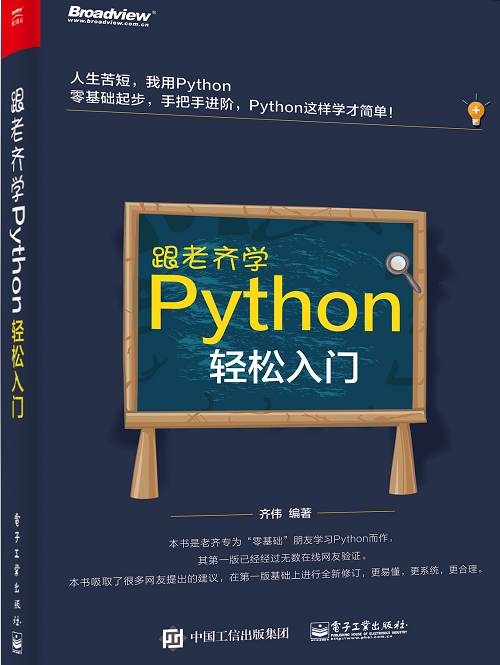

>In the begning when God created the heavens and the earth. the earth was a formless void and darkness covered the face of the deep, while a wind from God swept over the face of the waters. Then God said,"Let there be light"; and there was light. And God saw that the light was good; and God separated the light from the darkness. (GENESIS 1:1-4)

# 《跟老齐学Python：轻松入门》

本项目为《跟老齐学Python：轻松入门》一书的相关代码。此书是为初学Python的朋友而作，在各大网店有售。

# 相关资源

## 读者QQ群：26913719

说明：此QQ群是读者交流，而非作者答疑区，请特别注意。如果读者有问题，可以在群里面跟其它读者交流。作者没有答疑的义务。恕不接待任何形式的答疑。

## 微信公众号：老齐教室

## 与本书相关的其他资源：

- 勘误与修订：https://itdiffer.com/2020/04/30/learn-python-with-laoqi/
- 推荐相关视频课程：
  - CSDN学院：[《Python零基础轻松入门》](https://edu.csdn.net/course/detail/26676)
  - 网易云课堂：[《Python全栈工程师》](https://mooc.study.163.com/smartSpec/detail/1202847601.htm)
- 更多文章：[Python编程文章汇总](https://mp.weixin.qq.com/s/zkfCSuyMndWXkUashl3peg)

## 购买地址

各大电商平台有售。