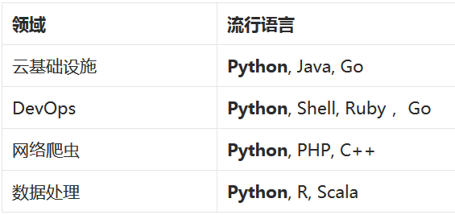

#大数据全栈式开发语言 – Python

来源：http://www.techug.com/full-stack-python

前段时间，ThoughtWorks 在深圳举办一次社区活动上，有一个演讲主题叫做“Fullstack JavaScript”，是关于用 JavaScript 进行前端、服务器端，甚至数据库（MongoDB）开发，一个 Web 应用开发人员，只需要学会一门语言，就可以实现整个应用。

受此启发，我发现 Python 可以称为大数据全栈式开发语言。因为 Python 在云基础设施，DevOps，大数据处理等领域都是炙手可热的语言。

就像只要会 JavaScript 就可以写出完整的 Web 应用，只要会 Python，就可以实现一个完整的大数据处理平台。

##云基础设施

这年头，不支持云平台，不支持海量数据，不支持动态伸缩，根本不敢说自己是做大数据的，顶多也就敢跟人说是做商业智能（BI）。

云平台分为私有云和公有云。私有云平台如日中天的 OpenStack，就是 Python 写的。曾经的追赶者 CloudStack，在刚推出时大肆强调自己是 Java 写的，比 Python 有优势。结果，搬石砸脚，2015 年初，CloudStack 的发起人 Citrix 宣布加入 OpenStack 基金会，CloudStack 眼看着就要寿终正寝。

如果嫌麻烦不想自己搭建私有云，用公有云，不论是 AWS，GCE，Azure，还是阿里云，青云，在都提供了 Python SDK，其中 GCE 只提供 Python 和 JavaScript 的 SDK，而青云只提供 Python SDK。可见各家云平台对 Python 的重视。

提到基础设施搭建，不得不提 Hadoop，在今天，Hadoop 因为其 MapReduce 数据处理速度不够快，已经不再作为大数据处理的首选，但是 HDFS 和 Yarn——Hadoop 的两个组件——倒是越来越受欢迎。Hadoop 的开发语言是 Java，没有官方提供 Python 支持，不过有很多第三方库封装了 Hadoop 的 API 接口（pydoop，hadoopy 等等）。

Hadoop MapReduce 的替代者，是号称快上 100 倍的 Spark，其开发语言是 Scala，但是提供了 Scala，Java，Python 的开发接口，想要讨好那么多用 Python 开发的数据科学家，不支持 Python，真是说不过去。HDFS 的替代品，比如 GlusterFS，Ceph 等，都是直接提供 Python 支持。Yarn 的替代者，Mesos 是 C++ 实现，除 C++ 外，提供了 Java 和 Python 的支持包。

##DevOps

DevOps 有个中文名字，叫做开发自运维。互联网时代，只有能够快速试验新想法，并在第一时间，安全、可靠的交付业务价值，才能保持竞争力。DevOps 推崇的自动化构建/测试/部署，以及系统度量等技术实践，是互联网时代必不可少的。

自动化构建是因应用而易的，如果是 Python 应用，因为有 setuptools, pip, virtualenv， tox， flake8 等工具的存在，自动化构建非常简单。而且，因为几乎所有 Linux 系统都内置 Python 解释器，所以用 Python 做自动化，不需要系统预安装什么软件。

自动化测试方面，基于 Python 的 Robot Framework 企业级应用最喜欢的自动化测试框架，而且和语言无关。Cucumber 也有很多支持者，Python 对应的 Lettuce 可以做到完全一样的事情。Locust 在自动化性能测试方面也开始受到越来越多的关注。

自动化配置管理工具，老牌的如 Chef 和 Puppet，是 Ruby 开发，目前仍保持着强劲的势头。不过，新生代 Ansible 和 SaltStack——均为 Python 开发——因为较前两者设计更为轻量化，受到越来越多开发这的欢迎，已经开始给前辈们制造了不少的压力。

在系统监控与度量方面，传统的 Nagios 逐渐没落，新贵如 Sensu 大受好评，云服务形式的 New Relic 已经成为创业公司的标配，这些都不是直接通过 Python 实现的，不过 Python 要接入这些工具，并不困难。

除了上述这些工具，基于 Python，提供完整 DevOps 功能的 PaaS 平台，如 Cloudify 和 Deis，虽未成气候，但已经得到大量关注。

##网络爬虫

大数据的数据从哪里来？除了部分企业有能力自己产生大量的数据，大部分时候，是需要靠爬虫来抓取互联网数据来做分析。

网络爬虫是 Python 的传统强势领域，最流行的爬虫框架 Scrapy，HTTP 工具包 urlib2，HTML 解析工具 beautifulsoup，XML 解析器 lxml，等等，都是能够独当一面的类库。

不过，网络爬虫并不仅仅是打开网页，解析 HTML 这么简单。高效的爬虫要能够支持大量灵活的并发操作，常常要能够同时几千甚至上万个网页同时抓取，传统的线程池方式资源浪费比较大，线程数上千之后系统资源基本上就全浪费在线程调度上了。Python 由于能够很好的支持协程（Coroutine）操作，基于此发展起来很多并发库，如 Gevent，Eventlet，还有 Celery 之类的分布式任务框架。被认为是比 AMQP 更高效的 ZeroMQ 也是最早就提供了 Python 版本。有了对高并发的支持，网络爬虫才真正可以达到大数据规模。

抓取下来的数据，需要做分词处理，Python 在这方面也不逊色，著名的自然语言处理程序包 NLTK，还有专门做中文分词的 Jieba，都是做分词的利器。

##数据处理

万事俱备，只欠东风。这东风，就是数据处理算法。从统计理论，到数据挖掘，机器学习，再到最近几年提出来的深度学习理论，数据科学正处于百花齐放的时代。数据科学家们都用什么编程？

如果是在理论研究领域，R语言也许是最受数据科学家欢迎的，但是R语言的问题也很明显，因为是统计学家们创建了R语言，所以其语法略显怪异。而且R语言要想实现大规模分布式系统，还需要很长一段时间的工程之路要走。所以很多公司使用R语言做原型试验，算法确定之后，再翻译成工程语言。

Python 也是数据科学家最喜欢的语言之一。和R语言不同，Python 本身就是一门工程性语言，数据科学家用 Python 实现的算法，可以直接用在产品中，这对于大数据初创公司节省成本是非常有帮助的。正式因为数据科学家对 Python 和R的热爱，Spark 为了讨好数据科学家，对这两种语言提供了非常好的支持。

Python 的数据处理相关类库非常多。高性能的科学计算类库 NumPy 和 SciPy，给其他高级算法打了非常好的基础，matploglib 让 Python 画图变得像 Matlab 一样简单。Scikit-learn 和 Milk 实现了很多机器学习算法，基于这两个库实现的 Pylearn2，是深度学习领域的重要成员。Theano 利用 GPU 加速，实现了高性能数学符号计算和多维矩阵计算。当然，还有 Pandas，一个在工程领域已经广泛使用的大数据处理类库，其 DataFrame 的设计借鉴自R语言，后来又启发了 Spark 项目实现了类似机制。

对了，还有 iPython，这个工具如此有用，以至于我差点把他当成标准库而忘了介绍。iPython 是一个交互式 Python 运行环境，能够实时看到每一段 Python 代码的结果。默认情况下，iPython 运行在命令行，可以执行ipython notebook在网页中运行。用 matplotlib 绘制的图可以直接嵌入式的显示在 iPython Notebook 中。

iPython Notebook 的笔记本文件可以共享给其他人，这样其他人就可以在自己的环境中重现你的工作成果；如果对方没有运行环境，还可以直接转换成 HTML 或者 PDF。

##为什么是 Python

正是因为应用开发工程师、运维工程师、数据科学家都喜欢 Python，才使得 Python 成为大数据系统的全栈式开发语言。

**对于开发工程师而言，**Python 的优雅和简洁无疑是最大的吸引力，在 Python 交互式环境中，执行import this，读一读 Python 之禅，你就明白 Python 为什么如此吸引人。Python 社区一直非常有活力，和 NodeJS 社区软件包爆炸式增长不同，Python 的软件包增长速度一直比较稳定，同时软件包的质量也相对较高。有很多人诟病 Python 对于空格的要求过于苛刻，但正是因为这个要求，才使得 Python 在做大型项目时比其他语言有优势。OpenStack 项目总共超过 200 万行代码，证明了这一点。

**对于运维工程师而言，**Python 的最大优势在于，几乎所有 Linux 发行版都内置了 Python 解释器。Shell 虽然功能强大，但毕竟语法不够优雅，写比较复杂的任务会很痛苦。用 Python 替代 Shell，做一些复杂的任务，对运维人员来说，是一次解放。

**对于数据科学家而言，**Python 简单又不失强大。和C/C++相比，不用做很多的底层工作，可以快速进行模型验证；和 Java 相比，Python 语法简洁，表达能力强，同样的工作只需要1/3 代码；和 Matlab，Octave 相比，Python 的工程成熟度更高。不止一个编程大牛表达过，Python 是最适合作为大学计算机科学编程课程使用的语言——MIT 的计算机入门课程就是使用的 Python——因为 Python 能够让人学到编程最重要的东西——如何解决问题。

顺便提一句，微软参加 2015 年 PyCon，高调宣布提高 Python 在 Windows 上的编程体验，包括 Visual Studio 支持 Python，优化 Python 的C扩展在 Windows 上的编译等等。脑补下未来 Python 作为 Windows 默认组件的场景。