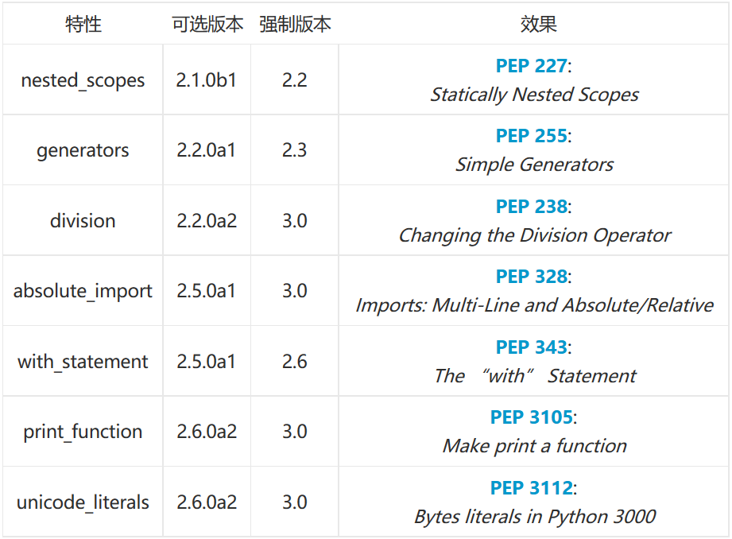

#Python2.7.x和3.x版本的重要区别

很多刚刚学习python的朋友，都纠结于目前Python的两个版本，虽然我已经对此进行了阐述（请阅读[《Python安装》](https://github.com/qiwsir/StarterLearningPython/blob/master/03.md)），但是，能够认真阅读的人不多。很多人是一目十行，看个大概罢了，重要观点往往忽视。

这里我选取网上一文章，该文讲述了一些具体的区别。供读者参考。

文章来源：http://blog.jobbole.com/80006/

许多Python初学者都会问：我应该学习哪个版本的Python。对于这个问题，我的回答通常是“先选择一个最适合你的Python教程，教程中使用哪个版本的Python，你就用那个版本。等学得差不多了，再来研究不同版本之间的差别”。

但如果想要用Python开发一个新项目，那么该如何选择Python版本呢？我可以负责任的说，大部分Python库都同时支持Python 2.7.x和3.x版本的，所以不论选择哪个版本都是可以的。但为了在使用Python时避开某些版本中一些常见的陷阱，或需要移植某个Python项目时，依然有必要了解一下Python两个常见版本之间的主要区别。

##`__future__`模块

Python3.x引入了一些与Python2不兼容的关键字和特性，在Python2中，可以通过内置的`__future__`模块导入这些新内容。如果你希望在Python2环境下写的代码也可以在Python 3.x中运行，那么建议使用`__future__`模块。例如，如果希望在Python2中拥有Python3.x的整数除法行为，可以通过下面的语句导入相应的模块。

    from __future__ import division
	
下表列出了`__future__`中其他可导入的特性：

###示例：

    from platform import python_version
	
##print函数

虽然print语法是Python3中一个很小的改动，且应该已经广为人知，但依然值得提一下：Python2中的print语句被Python3中的print()函数取代，这意味着在Python3中必须用括号将需要输出的对象括起来。

在Python2中使用额外的括号也是可以的。但反过来在Python3中想以Python2的形式不带括号调用print函数时，会触发`SyntaxError`。

###Python 2
	
    print 'Python', python_version()
    print 'Hello, World!'
    print('Hello, World!')
    print "text", ; print 'print more text on the same line'
	
    Python 2.7.6
    Hello, World!
    Hello, World!
    text print more text on the same line
	
###Python 3
	
    print('Python', python_version())
    print('Hello, World!')
 
    print("some text,", end="") 
    print(' print more text on the same line')
	
    Python 3.4.1
    Hello, World!
    some text, print more text on the same line
	
    print 'Hello, World!'
	
	File "<ipython-input-3-139a7c5835bd>", line 1
    print 'Hello, World!'
    ^
    SyntaxError: invalid syntax
	
###注意：

在Python中，带不带括号输出”Hello World”都很正常。但如果在圆括号中同时输出多个对象时，就会创建一个元组，这是因为在Python2中，print是一个语句，而不是函数调用。
	
    print 'Python', python_version()
    print('a', 'b')
    print 'a', 'b'

    Python 2.7.7
    ('a', 'b')
    a b
	
##整数除法

由于人们常常会忽视Python3在整数除法上的改动（写错了也不会触发Syntax Error），所以在移植代码或在Python2中执行Python3的代码时，需要特别注意这个改动。

所以，我还是会在Python3的脚本中尝试用float(3)/2或 3/2.0代替3/2，以此来避免代码在Python2环境下可能导致的错误（或与之相反，在Python 2脚本中用`from __future__ import division`来使用Python3的除法）。

###Python 2
	
    print 'Python', python_version()
    print '3 / 2 =', 3 / 2
    print '3 // 2 =', 3 // 2
    print '3 / 2.0 =', 3 / 2.0
    print '3 // 2.0 =', 3 // 2.0

    Python 2.7.6
    3 / 2 = 1
    3 // 2 = 1
    3 / 2.0 = 1.5
    3 // 2.0 = 1.0
	
###Python 3
	
    print('Python', python_version())
    print('3 / 2 =', 3 / 2)
    print('3 // 2 =', 3 // 2)
    print('3 / 2.0 =', 3 / 2.0)
    print('3 // 2.0 =', 3 // 2.0)

    Python 3.4.1
    3 / 2 = 1.5
    3 // 2 = 1
    3 / 2.0 = 1.5
    3 // 2.0 = 1.0
	
##Unicode

Python2有基于ASCII的str()类型，其可通过单独的unicode()函数转成unicode类型，但没有byte类型。

而在Python3中，终于有了Unicode（utf-8）字符串，以及两个字节类：bytes和bytearrays。

###Python 2
	
    print 'Python', python_version()

    Python 2.7.6
	
    print type(unicode('this is like a python3 str type'))

    <type 'unicode'>

    print type(b'byte type does not exist')

    <type 'str'>

    print 'they are really' + b' the same'

    they are really the same

    print type(bytearray(b'bytearray oddly does exist though'))

    <type 'bytearray'>

###Python 3
	
    print('Python', python_version())
    print('strings are now utf-8 u03BCnicou0394é!')

    Python 3.4.1
    strings are now utf-8 μnicoΔé!
	
    print('Python', python_version(), end="")
    print(' has', type(b' bytes for storing data'))

    Python 3.4.1 has <class 'bytes'>

    print('and Python', python_version(), end="")
    print(' also has', type(bytearray(b'bytearrays')))

    and Python 3.4.1 also has <class 'bytearray'>

    'note that we cannot add a string' + b'bytes for data'

    TypeError Traceback (most recent call last)
    <ipython-input-13-d3e8942ccf81> in <module>()
    ----> 1 'note that we cannot add a string' + b'bytes for data'

    TypeError: Can't convert 'bytes' object to str implicitly

##xrange

在Python2.x中，经常会用`xrange()`创建一个可迭代对象，通常出现在“for循环”或“列表/集合/字典推导式”中。

这种行为与生成器非常相似（如”惰性求值“），但这里的xrange-iterable无尽的，意味着可能在这个xrange上无限迭代。

由于xrange的“惰性求知“特性，如果只需迭代一次（如for循环中），range()通常比xrange()快一些。不过不建议在多次迭代中使用range()，因为range()每次都会在内存中重新生成一个列表。

在Python 3中，range()的实现方式与xrange()函数相同，所以就不存在专用的xrange()（在Python 3中使用xrange()会触发NameError）。
	
    import timeit
 
    n = 10000
    def test_range(n):
        return for i in range(n):
        pass
 
    def test_xrange(n):
        for i in xrange(n):
        pass

###Python 2
	
    print 'Python', python_version()
 
    print 'ntiming range()'
    %timeit test_range(n)
 
    print 'nntiming xrange()'
    %timeit test_xrange(n)

    Python 2.7.6

    timing range()
    1000 loops, best of 3: 433 µs per loop

    timing xrange()
    1000 loops, best of 3: 350 µs per loop

###Python 3
	
    print('Python', python_version())
 
    print('ntiming range()')
    %timeit test_range(n)

    Python 3.4.1

    timing range()
    1000 loops, best of 3: 520 µs per loop

    print(xrange(10))

    ---------------------------------------------------------------------------
    NameError Traceback (most recent call last)
    in ()
    ----> 1 print(xrange(10))

    NameError: name 'xrange' is not defined

##Python 3中的range对象中的`__contains__`方法

另一个值得一提的是，在Python 3.x中，range有了一个新的`__contains__`方法。`__contains__`方法可以有效的加快Python 3.x中整数和布尔型的“查找”速度。
	
    x = 10000000
    def val_in_range(x, val):
        return val in range(x)
 
    def val_in_xrange(x, val):
        return val in xrange(x)
 
     print('Python', python_version())
    assert(val_in_range(x, x/2) == True)
    assert(val_in_range(x, x//2) == True)
    %timeit val_in_range(x, x/2)
    %timeit val_in_range(x, x//2)

    Python 3.4.1
    1 loops, best of 3: 742 ms per loop
    1000000 loops, best of 3: 1.19 µs per loop

根据上面的timeit的结果，查找整数比查找浮点数要快大约6万倍。但由于Python 2.x中的range或xrange没有`__contains__`方法，所以在Python 2中的整数和浮点数的查找速度差别不大。
	
    print 'Python', python_version()
 
    assert(val_in_xrange(x, x/2.0) == True)
    assert(val_in_xrange(x, x/2) == True)
    assert(val_in_range(x, x/2) == True)
    assert(val_in_range(x, x//2) == True)
    %timeit val_in_xrange(x, x/2.0)
    %timeit val_in_xrange(x, x/2)
    %timeit val_in_range(x, x/2.0)
    %timeit val_in_range(x, x/2)

    Python 2.7.7
    1 loops, best of 3: 285 ms per loop
    1 loops, best of 3: 179 ms per loop
    1 loops, best of 3: 658 ms per loop
    1 loops, best of 3: 556 ms per loop

下面的代码证明了Python 2.x中没有`__contains__`方法：

    print('Python', python_version())
    range.__contains__

    Python 3.4.1
    <slot wrapper '__contains__' of 'range' objects
	
    print('Python', python_version())
    range.__contains__

    Python 2.7.7
    ---------------------------------------------------------------------------
    AttributeError Traceback (most recent call last)
    <ipython-input-7-05327350dafb> in <module>()
    1 print 'Python', python_version()
    ----> 2 range.__contains__

    AttributeError: 'builtin_function_or_method' object has no attribute '__contains__'
	
    print('Python', python_version())
    xrange.__contains__

    Python 2.7.7

    ---------------------------------------------------------------------------
    AttributeError Traceback (most recent call last)
    in ()
    1 print 'Python', python_version()
    ----> 2 xrange.__contains__

    AttributeError: type object 'xrange' has no attribute '__contains__'

##关于Python 2中xrange()与Python 3中range()之间的速度差异的一点说明：

有读者指出了Python 3中的range()和Python 2中xrange()执行速度有差异。由于这两者的实现方式相同，因此理论上执行速度应该也是相同的。这里的速度差别仅仅是因为Python 3的总体速度就比Python 2慢。
	
    def test_while():
        i = 0
        while i < 20000:
            i += 1
        return
	
    print('Python', python_version())
    %timeit test_while()

    Python 3.4.1
    %timeit test_while()
    100 loops, best of 3: 2.68 ms per loop
	
    print 'Python', python_version()
    %timeit test_while()

    Python 2.7.6
     1000 loops, best of 3: 1.72 ms per loop

##触发异常

Python 2支持新旧两种异常触发语法，而Python 3只接受带括号的的语法（不然会触发SyntaxError）：

###Python 2
	
    print 'Python', python_version()

    Python 2.7.6
	
    raise IOError, "file error"

    ---------------------------------------------------------------------------
    IOError Traceback (most recent call last)
    <ipython-input-8-25f049caebb0> in <module>()
    ----> 1 raise IOError, "file error"

    IOError: file error
	
    raise IOError("file error")

    ---------------------------------------------------------------------------
    IOError Traceback (most recent call last)
    <ipython-input-9-6f1c43f525b2> in <module>()
    ----> 1 raise IOError("file error")

    IOError: file error

###Python 3

    print('Python', python_version())

    Python 3.4.1
	
    raise IOError, "file error"

    File "<ipython-input-10-25f049caebb0>", line 1
    raise IOError, "file error"
    ^
    SyntaxError: invalid syntax
    The proper way to raise an exception in Python 3:
	
    print('Python', python_version())
    raise IOError("file error")

    Python 3.4.1

    ---------------------------------------------------------------------------
    OSError Traceback (most recent call last)
    <ipython-input-11-c350544d15da> in <module>()
    1 print('Python', python_version())
    ----> 2 raise IOError("file error")

    OSError: file error

##异常处理

Python 3中的异常处理也发生了一点变化。在Python 3中必须使用“as”关键字。

###Python 2
	
    print 'Python', python_version()
    try:
        let_us_cause_a_NameError
    except NameError, err:
        print err, '--> our error message'

    Python 2.7.6
    name 'let_us_cause_a_NameError' is not defined --> our error message

###Python 3

    print('Python', python_version())
    try:
        let_us_cause_a_NameError
    except NameError as err:
        print(err, '--> our error message')

    Python 3.4.1
    name 'let_us_cause_a_NameError' is not defined --> our error message

##next()函数和.next()方法

由于会经常用到next()（.next()）函数（方法），所以还要提到另一个语法改动（实现方面也做了改动）：在Python 2.7.5中，函数形式和方法形式都可以使用，而在Python 3中，只能使用next()函数（试图调用.next()方法会触发AttributeError）。

###Python 2

    print 'Python', python_version()
    my_generator = (letter for letter in 'abcdefg')
    next(my_generator)
    my_generator.next()

    Python 2.7.6
    'b'

###Python 3

    print('Python', python_version())
    my_generator = (letter for letter in 'abcdefg')
    next(my_generator)

    Python 3.4.1
    'a'

    my_generator.next()

    ---------------------------------------------------------------------------
    AttributeError Traceback (most recent call last)
    <ipython-input-14-125f388bb61b> in <module>()
    ----> 1 my_generator.next()

    AttributeError: 'generator' object has no attribute 'next'

##For循环变量与全局命名空间泄漏

好消息是：在Python 3.x中，for循环中的变量不再会泄漏到全局命名空间中了！

这是Python 3.x中做的一个改动，在“What’s New In Python 3.0”中有如下描述：

“列表推导不再支持[... for var in item1, item2, ...]这样的语法，使用[... for var in (item1, item2, ...)]代替。还要注意列表推导有不同的语义：现在列表推导更接近list()构造器中的生成器表达式这样的语法糖，特别要注意的是，循环控制变量不会再泄漏到循环周围的空间中了。”

###Python 2
	
    print 'Python', python_version()
 
    i = 1
    print 'before: i =', i
 
    print 'comprehension: ', [i for i in range(5)]
 
    print 'after: i =', i

    Python 2.7.6
    before: i = 1
    comprehension: [0, 1, 2, 3, 4]
    after: i = 4

###Python 3

    print('Python', python_version())
 
    i = 1
    print('before: i =', i)
 
    print('comprehension:', [i for i in range(5)])
 
    print('after: i =', i)

    Python 3.4.1
    before: i = 1
    comprehension: [0, 1, 2, 3, 4]
    after: i = 1

##比较无序类型
 
Python 3中另一个优秀的改动是，如果我们试图比较无序类型，会触发一个TypeError。

###Python 2
	
    print 'Python', python_version()
    print "[1, 2] > 'foo' = ", [1, 2] > 'foo'
    print "(1, 2) > 'foo' = ", (1, 2) > 'foo'
    print "[1, 2] > (1, 2) = ", [1, 2] > (1, 2)

    Python 2.7.6
    [1, 2] > 'foo' = False
    (1, 2) > 'foo' = True
    [1, 2] > (1, 2) = False

###Python 3
	
    print('Python', python_version())
    print("[1, 2] > 'foo' = ", [1, 2] > 'foo')
    print("(1, 2) > 'foo' = ", (1, 2) > 'foo')
    print("[1, 2] > (1, 2) = ", [1, 2] > (1, 2))

    Python 3.4.1
    ---------------------------------------------------------------------------
    TypeError Traceback (most recent call last)
    <ipython-input-16-a9031729f4a0> in <module>()
    1 print('Python', python_version())
    ----> 2 print("[1, 2] > 'foo' = ", [1, 2] > 'foo')
    3 print("(1, 2) > 'foo' = ", (1, 2) > 'foo')
    4 print("[1, 2] > (1, 2) = ", [1, 2] > (1, 2))
    TypeError: unorderable types: list() > str()

##通过`input()`解析用户的输入

幸运的是，Python 3改进了input()函数，这样该函数就会总是将用户的输入存储为str对象。在Python 2中，为了避免读取非字符串类型会发生的一些危险行为，不得不使用raw_input()代替input()。

###Python 2
	
    Python 2.7.6
    [GCC 4.0.1 (Apple Inc. build 5493)] on darwin
    Type "help", "copyright", "credits" or "license" for more information.
 
    >>> my_input = input('enter a number: ')
 
    enter a number: 123
 
    >>> type(my_input)
    <type 'int'>
 
    >>> my_input = raw_input('enter a number: ')
 
    enter a number: 123
 
    >>> type(my_input)
    <type 'str'>

###Python 3

    Python 3.4.1
    [GCC 4.2.1 (Apple Inc. build 5577)] on darwin
    Type "help", "copyright", "credits" or "license" for more information.
 
    >>> my_input = input('enter a number: ')
    enter a number: 123
    >>> type(my_input)
    <class 'str'>
	
##返回可迭代对象，而不是列表

在xrange一节中可以看到，某些函数和方法在Python中返回的是可迭代对象，而不像在Python 2中返回列表。

由于通常对这些对象只遍历一次，所以这种方式会节省很多内存。然而，如果通过生成器来多次迭代这些对象，效率就不高了。

此时我们的确需要列表对象，可以通过list()函数简单的将可迭代对象转成列表。

###Python 2
	
    print 'Python', python_version()
 
    print range(3)
    print type(range(3))

    Python 2.7.6
    [0, 1, 2]
    <type 'list'>

###Python 3

    print('Python', python_version())
    print(range(3))
    print(type(range(3)))
    print(list(range(3)))

    Python 3.4.1
    range(0, 3)
    <class 'range'>
    [0, 1, 2]

下面列出了Python 3中其他不再返回列表的常用函数和方法：

- zip()
- map()
- filter()
- 字典的.key()方法
- 字典的.value()方法
- 字典的.item()方法

##更多关于Python 2和Python 3的文章

下面列出了其他一些可以进一步了解Python 2和Python 3的优秀文章，

//迁移到 Python 3

- [Should I use Python 2 or Python 3 for my development activity?](https://wiki.python.org/moin/Python2orPython3)

- [What’s New In Python 3.0](https://docs.python.org/3.0/whatsnew/3.0.html)

- [Porting to Python 3](http://python3porting.com/differences.html)

- [Porting Python 2 Code to Python 3](https://docs.python.org/3/howto/pyporting.html)

- [How keep Python 3 moving forward](http://nothingbutsnark.svbtle.com/my-view-on-the-current-state-of-python-3)

// 对Python 3的褒与贬

- [10 awesome features of Python that you can’t use because you refuse to upgrade to Python 3](http://asmeurer.github.io/python3-presentation/slides.html#1)

- [关于你不想知道的所有Python3 unicode特性](http://blog.jobbole.com/73974/)

- [Python 3 正在毁灭 Python](http://blog.jobbole.com/69811/)

- [Python 3 能振兴 Python](http://blog.jobbole.com/75158/)

- [Python 3 is fine](http://sealedabstract.com/rants/python-3-is-fine/)
